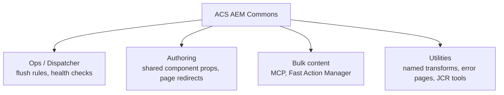

export const meta = {
  order: 1,
  num: '01',
  title: 'What is ACS AEM Commons & Deploying It',
  topics: 'a community toolkit · what it gives you · adding it to a project'
};

**ACS AEM Commons** is a widely-used, open-source library of ready-made tools, services and components
for AEM — maintained by the Adobe community (Adobe Consulting Services). Instead of re-inventing common
plumbing, you install it and configure the bits you need.

## What's in the box (themes)



## Deploying it

ACS Commons is a content package + bundle. The clean way is to add it to your project's **`all`**
package as a dependency so it deploys with everything else:

```xml
<dependency>
  <groupId>com.adobe.acs</groupId>
  <artifactId>acs-aem-commons-all</artifactId>
  <version><!-- match your AEM version --></version>
</dependency>
```

Embed it in the `all` package's `filevault-package` config, or — for a quick local try — upload the
released package via **Package Manager** (`/crx/packmgr`).

After install, its features live under **Tools → ACS AEM Commons** and as configurable OSGi services.

<Callout type="warn">Pick the ACS Commons version that matches your **AEM version** (and AEMaaCS vs 6.5 — there are different artifacts). A mismatch can fail to activate bundles.</Callout>

<Callout type="do">Treat ACS Commons like any dependency: pin a version, embed it in `all`, and deploy it through your pipeline — not by hand on each environment. Then enable only the features you actually use.</Callout>
