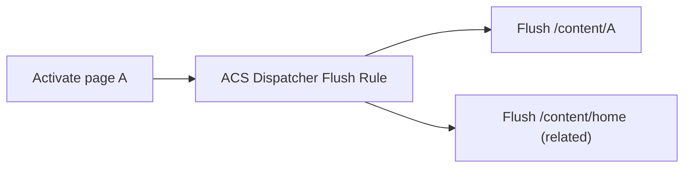

export const meta = {
  order: 2,
  num: '02',
  title: 'Useful ACS Commons Features',
  topics: 'dispatcher flush rules · shared props · named transforms · redirect map · MCP · health checks'
};

A tour of the features you'll reach for most. Each is opt-in — enable via an OSGi config or a tool UI.

## Operations & dispatcher

- **Dispatcher Flush Rules** — when page A is activated, also flush related paths B/C from the dispatcher cache (e.g. flush the homepage when any child changes). Solves stale-cache problems beyond the default tree flush.
- **Health Checks** — ready-made Sling Health Checks (and a dashboard) for monitoring.
- **Error Page Handler** — map error codes to friendly, authorable error pages per site.

## Authoring

- **Shared / Global Component Properties** — values authored once at the page or site level and read by many component instances (e.g. a shared phone number) — no repeating fields per component.
- **Redirect Manager** — author and manage vanity/SEO redirects in a UI, backed by a redirect map.
- **Pages Reference Provider / Component-level tools** — surface where content is reused.

## Bulk content & data

- **MCP (Manage Controlled Processes)** — a framework + UI for safe, resumable bulk operations: bulk asset import/ingestion, tag/property updates, folder restructuring, with reporting.
- **Fast Action Manager** — high-throughput engine for processing large content sets efficiently.

## Utilities

- **Named Image Transforms** — define a named server-side image transform (crop/resize/greyscale) and request it via a suffix — handy for on-the-fly variants.
- **JCR / Query tools, Workflow utilities, On-Deploy Scripts** — assorted developer helpers.

<Callout type="do">Don't hand-roll dispatcher flush logic, bulk-update scripts, or redirect handling — ACS Commons has battle-tested versions. Enable the specific feature's OSGi config, and read its docs for the exact properties.</Callout>

<Callout type="note">ACS Commons is community-maintained, not Adobe-supported product code. It's excellent and ubiquitous — but vet each feature for your AEM version and pin the dependency, as with any third-party library.</Callout>
