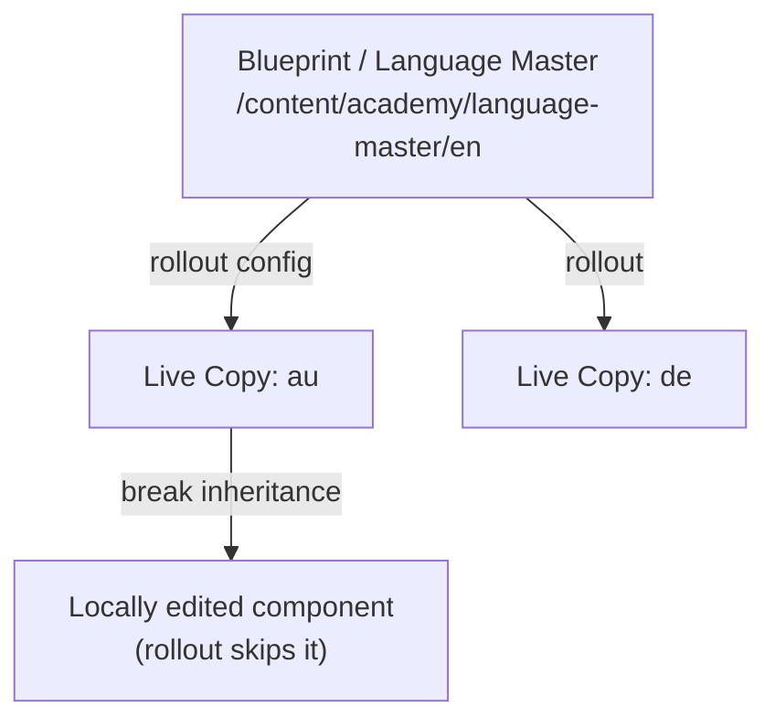

export const meta = {
  order: 5,
  num: '05',
  title: 'MSM: Live Copies & Rollout',
  topics: 'blueprint / language master · live copy · rollout configs · inheritance'
};

**Multi-Site Management** (MSM) lets one source site drive many derived sites — translations, regional
variants — without copy-pasting content.

## The vocabulary

- **Blueprint / language master** — the source site (e.g. `/content/academy/language-master/en`).
- **Live copy** — a derived site that **inherits** from the master.
- **Rollout config** — the rules deciding *what* syncs from master to live copy and *when*.
- **Rollout** — the act of pushing master changes down into the live copies.

## Create a live copy

1. In **Sites**, select the source — the English **language master**.
2. **Create → Live Copy**.
3. Choose a **destination** (e.g. under *Academy*), a **title** ("Australian homepage") and a **name** (`au`).
4. Pick a **Rollout config** — *Standard rollout config* — and **Save**.

You now have `…/academy/au`, mirroring the master.

## Inheritance

Each component in a live copy **inherits** from the master by default. Edit one locally and you
**break inheritance** for that component (a chain icon marks it as detached) — a later rollout won't
overwrite your local change. Re-enable inheritance to resume syncing.

<Callout type="do">Author shared content **once** in the master and roll it out. Only break inheritance where a region genuinely differs — every break is something you then maintain by hand.</Callout>
