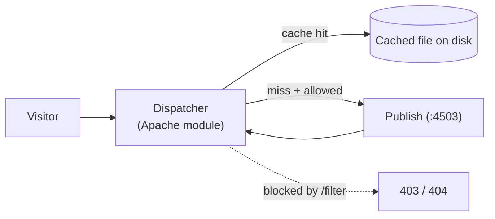

export const meta = {
  order: 7,
  num: '07',
  title: 'The Dispatcher: Caching & Security',
  topics: 'reverse proxy · cache + invalidation · security filters · the flush agent'
};

In production, visitors don't hit publish directly — they go through the **Dispatcher**, an Apache
HTTP Server module in front of publish that is both the **caching layer** and the **security layer**.



## What it does

- **Caches** rendered pages and assets to disk and serves them, so most requests never reach AEM — big for performance and resilience.
- **Filters** requests (security): a deny-by-default ruleset that only lets safe paths/extensions/methods through.
- **Load-balances** across multiple publish instances.

## Caching & invalidation

The dispatcher caches a `GET` response the first time it's requested, then serves that file until it's
**invalidated**:

- Configured in `dispatcher.any` under a farm's `/cache` (`/rules`, `/invalidate`, `/statfileslevel`).
- **Not cached:** authenticated requests, most query-string URLs, non-`GET` methods.
- **Invalidation:** when a page is **activated**, publish's **Dispatcher Flush** replication agent sends an invalidation request; the dispatcher drops the affected cache (often by touching a **statfile** that ages out a whole tree).

<Callout type="note">This ties back to *Replication*: activate → publish → the flush agent pings the dispatcher → stale cache is invalidated, so visitors get the fresh page.</Callout>

## Security filters

The `/filter` section is **deny by default** — you explicitly allow what's public:

```text
# deny everything, then allow specific, safe requests
/0001 { /type "deny"  /glob "*" }
/0010 { /type "allow" /url "/content/*" }   # only the content tree
```

Block the dangerous bits: `.json` / `.infinity` selectors, `/bin/*` and `/system/*`, cache-busting
query selectors, and non-`GET` methods on public URLs.

## Practice

- [ ] Inspect a `dispatcher.any`: find the `/cache /rules` (what's cacheable) and the `/filter` (what's allowed).
- [ ] Activate a page and confirm the cached file appears in the dispatcher docroot; re-activate and confirm it's invalidated.
- [ ] Add a deny rule for `*.json` under `/content` and verify that path is now blocked through the dispatcher.

<Callout type="warn">A page works on publish (`:4503`) but not through the dispatcher? It's almost always a **filter** blocking it or a stale **cache** — check those two first.</Callout>
