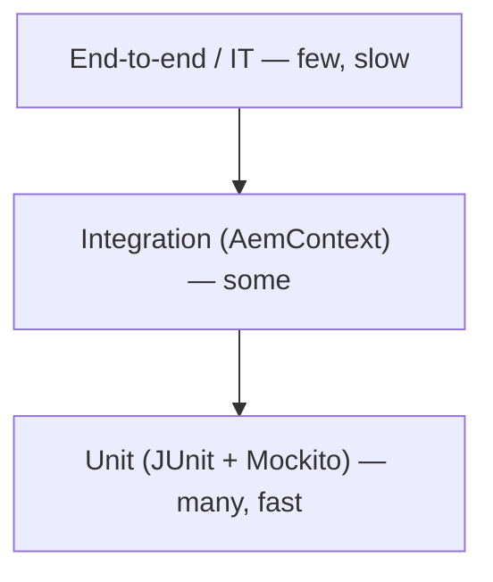

export const meta = {
  order: 1,
  num: '01',
  title: 'Why Unit-test AEM Code',
  topics: 'the value of tests · what to test · the AEM testing toolbox'
};

A unit test runs a small piece of your Java in **isolation**, fast, with no running AEM. It documents
intent, catches regressions on every build, and lets you refactor without fear.

## What's worth testing in AEM

- **Sling Models** — given content, do the getters return the right shaped data? (highest value, easiest)
- **OSGi services** — does the business logic behave across inputs and config?
- **Servlets** — given a request, is the response correct?
- **Workflow processes / job consumers** — does the step do the right thing?

Skip testing the framework itself (HTL, the JCR) — test **your** logic.



Most of your tests should be fast units at the base; reach for `AemContext` only when you genuinely
touch Sling APIs.

## The toolbox

| Tool | Role |
|---|---|
| **JUnit 5** | the test runner + assertions (`@Test`, `assertEquals`) |
| **Mockito** | fake collaborators (`mock`, `when`, `verify`) |
| **AEM Mocks** (`io.wcm`) | an in-memory AEM context — resources, `ValueMap`, models, OSGi |

These live as **test-scoped** dependencies in the `core` module and run with `mvn test` — part of every
build, so a broken contract fails CI before it ships.

## The shape of a test: Arrange · Act · Assert

```java
@Test
void formatsPriceInEuros() {
  PriceFormatter f = new PriceFormatterImpl();          // arrange
  String out = f.format(1999, Locale.GERMANY);          // act
  assertEquals("19,99 €", out);                          // assert
}
```

<Callout type="do">Aim for **fast, isolated, repeatable** tests. If a test needs a real server, a network call, or sleeps, it's not a unit test — mock the boundary and test the logic.</Callout>
