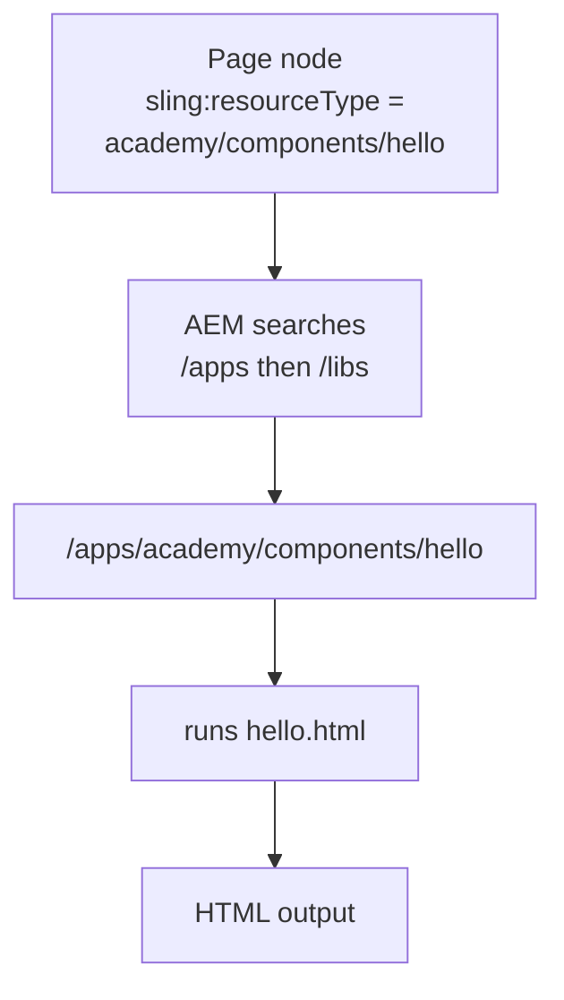

export const meta = {
  order: 1,
  num: '01',
  title: 'Component Structure',
  topics: 'Where components live · <code>.content.xml</code> · resource type · the default script'
};

An AEM component is just a **folder of files under `/apps`**. At its simplest it needs two
things: a node that declares "I am a component", and an HTL script that renders it.

## Where components live

In this project they sit under `/apps/academy/components/<name>/`:

```text
ui.apps/src/main/content/jcr_root/apps/academy/components/hello/
├── .content.xml        ← declares the component (cq:Component)
└── hello.html          ← the HTL script that renders it
```

<Callout type="note">The folder name (`hello`) is the component's name. AEM looks for a script named after the folder — `hello.html` — as the default renderer.</Callout>

## Declare the component — `.content.xml`

```xml
<?xml version="1.0" encoding="UTF-8"?>
<jcr:root xmlns:cq="http://www.day.com/jcr/cq/1.0" xmlns:jcr="http://www.jcp.org/jcr/1.0"
    jcr:primaryType="cq:Component"
    jcr:title="Hello"
    jcr:description="My first component"
    componentGroup="Academy"/>
```

- `cq:Component` — the node type that makes this a component.
- `jcr:title` — the label shown in the **Insert New Component** dialog.
- `componentGroup` — which group it belongs to. It must be **allowed by the template policy**
  to show up (covered in *Policies*).

## Render it — `hello.html`

```html
<h2 class="hello">Hello, AEM!</h2>
```

That's a complete component. It renders **once it's deployed and placed on a page** — the next
sections (and lessons) show how.

## How a page uses it

Every component instance is a JCR node whose `sling:resourceType` points at the component:

```xml
<hello
    jcr:primaryType="nt:unstructured"
    sling:resourceType="academy/components/hello"/>
```

AEM resolves `academy/components/hello` → the `/apps/academy/components/hello` folder → runs
`hello.html`. This `resourceType` → script resolution is the heart of how AEM renders pages.



## The resource-type search path

AEM searches `/apps` first, then `/libs`. That's also how you **override or extend**
out-of-the-box components: place a component at the same relative path under `/apps`, or point
`sling:resourceSuperType` at a base component to inherit its scripts.

<Callout type="do">One component = one responsibility. Compose pages from small components rather than building one giant one.</Callout>

## Build, deploy & place it

HTL is **not compiled locally** — your `.html` ships as-is and **AEM compiles it on the server**
at render time. There's no build step for the markup itself. To get the component onto your local
author (port 4502), run Maven from the project's **`code/`** folder:

```bash
mvn clean install -PautoInstallSinglePackage
```

It lands at `/apps/academy/components/hello` (verify in CRX/DE). It only **renders once it's placed
on a page** — two ways:

- **Via the author UI** — drop it from *Insert New Component*. For that it must be **allowed by the
  template policy** (see *Policies*) and have a **dialog** (see *No Dialog* / *Dialog*).
- **Directly in content** — add a node inside the page's **editable container**. On an editable
  template that's `jcr:content/root/responsivegrid` — **not `root` itself**. `root` is locked
  template structure (header, the responsivegrid, footer); nodes placed directly under `root`
  are ignored by the renderer and **won't show up**.

```xml
<!-- under …/content/academy/en/<page>/jcr:content/root/responsivegrid -->
<hello jcr:primaryType="nt:unstructured" sling:resourceType="academy/components/hello"/>
```

<Callout type="warn">Common trap: putting the node directly under `root`. It must go in the **editable** container (`root/responsivegrid`), or it renders nothing — even though the node exists in CRX/DE.</Callout>

<Callout type="note">Newly created and nothing happens? It's almost always one of: not deployed (run the Maven command), placed in the wrong container (use `root/responsivegrid`), not **allowed** by the policy, or (to insert via the UI) it has **no dialog**. The next lessons cover each.</Callout>

## What's next

The following lessons add, layer by layer: a component **with no dialog**, then a **dialog** to
let authors pass values, **clientlibs** for CSS/JS, **policies** for template-level
configuration, and the **Style System** for author-selectable variations.
