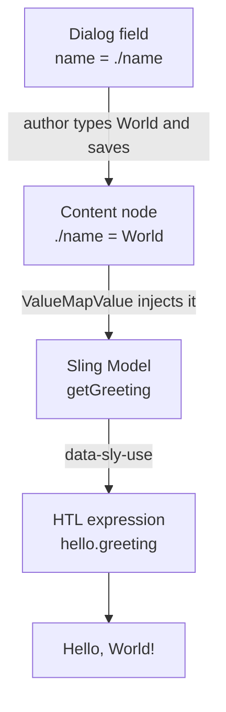

export const meta = {
  order: 3,
  num: '03',
  title: 'Creating a Dialog to Pass Values',
  topics: '<code>_cq_dialog</code> · Granite UI fields · <code>name="./prop"</code> · reading the value'
};

A **dialog** gives authors a form to edit a component instance. Dialogs are built from
**Granite UI** components and live in a `_cq_dialog` node next to the component. The value an
author types is stored on the content node and read back by your model or HTL.

## The file

```text
apps/academy/components/hello/
├── .content.xml
├── hello.html
└── _cq_dialog/
    └── .content.xml      ← the dialog definition
```

## A minimal dialog

```xml
<?xml version="1.0" encoding="UTF-8"?>
<jcr:root xmlns:sling="http://sling.apache.org/jcr/sling/1.0"
    xmlns:cq="http://www.day.com/jcr/cq/1.0" xmlns:jcr="http://www.jcp.org/jcr/1.0"
    xmlns:nt="http://www.jcp.org/jcr/nt/1.0"
    jcr:primaryType="nt:unstructured"
    jcr:title="Hello"
    sling:resourceType="cq/gui/components/authoring/dialog">
    <content jcr:primaryType="nt:unstructured"
        sling:resourceType="granite/ui/components/coral/foundation/container">
        <items jcr:primaryType="nt:unstructured">
            <name
                jcr:primaryType="nt:unstructured"
                sling:resourceType="granite/ui/components/coral/foundation/form/textfield"
                fieldLabel="Name"
                fieldDescription="Who do we greet?"
                name="./name"/>
        </items>
    </content>
</jcr:root>
```

<Callout type="note">The crucial part is `name="./name"` — it stores the value as the `name` property on the component's content node.</Callout>

## Reading the value

Read it in a **Sling Model** with `@ValueMapValue` (the field name matches the property):

```java
@Model(adaptables = Resource.class,
       defaultInjectionStrategy = DefaultInjectionStrategy.OPTIONAL)
public class HelloModel {

    @ValueMapValue
    @Default(values = "world")
    private String name;

    public String getGreeting() {
        return "Hello, " + name + "!";
    }
}
```

<Tabs>
<Tab label="Code">

```html
<sly data-sly-use.hello="biz.netcentric.academy.core.models.HelloModel"/>
<h2 class="hello">${hello.greeting}</h2>
```

</Tab>
<Tab label="Result">

With `name = "World"` authored in the dialog:

<h2>Hello, World!</h2>

</Tab>
</Tabs>

For trivial cases you can skip the model and read the property directly: `${properties.name}`.

## The full value flow



## Common field types

| Granite resource type | Field |
|---|---|
| `…/form/textfield` | single-line text |
| `…/form/textarea` | multi-line text |
| `…/form/numberfield` | number |
| `…/form/checkbox` | boolean |
| `…/form/select` | dropdown |
| `…/form/pathfield` | path picker (pages/assets) |

<Callout type="warn">A `numberfield` / `checkbox` left empty means the property is **null**. Guard with `@Default` in the model — an unguarded `${price > 100}` on a null value throws.</Callout>

## Organising bigger dialogs

Wrap fields in **tabs** (`granite/ui/components/coral/foundation/tabs`) and **fixed columns**
once you have more than a handful — see the project's `marquee` component for a multi-tab,
multifield example.

<Callout type="do">Always add `fieldDescription`s — authors rely on them, and they document the component.</Callout>
