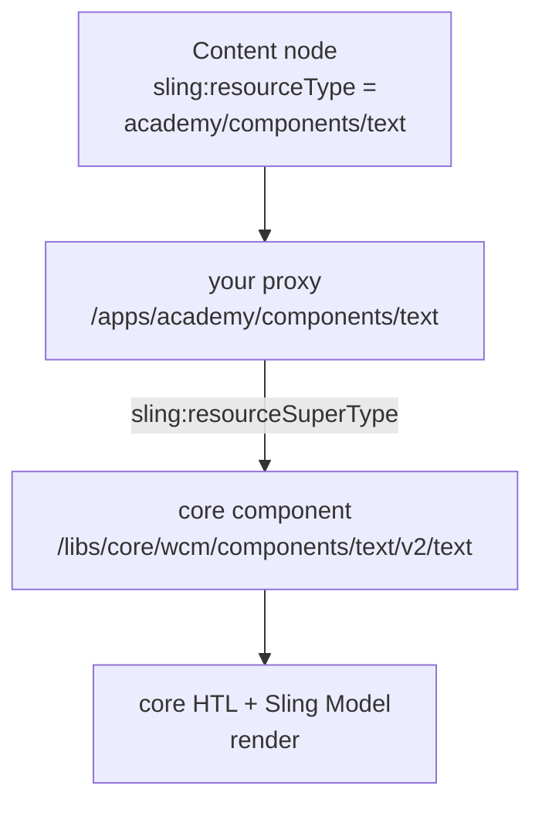

export const meta = {
  order: 6,
  num: '06',
  title: 'Reusing Core Components',
  topics: 'where they live · the proxy pattern · <code>sling:resourceSuperType</code> · allow &amp; configure'
};

AEM ships dozens of production-ready components — the **Core Components** (Text, Image, Title,
Teaser, List, Breadcrumb, and more). Don't rebuild them. You bring one into your project with a
**thin proxy** and a **policy**, then authors use it like any other component.

## Where Core Components live

They are **not in your repo**. They sit under `/libs/core/wcm/components/…` on the instance,
deployed from a Maven dependency (this project pins the version in the root `pom.xml`). See them in
the browser via:

- **Components console** — [http://localhost:4502/libs/wcm/core/content/sites/components.html](http://localhost:4502/libs/wcm/core/content/sites/components.html)
- **CRX/DE** (the raw nodes under `/libs`) — [http://localhost:4502/crx/de/index.jsp#/libs/core/wcm/components](http://localhost:4502/crx/de/index.jsp#/libs/core/wcm/components)
- **Adobe's Core Components Library** (no local AEM needed) — [https://opensource.adobe.com/aem-core-wcm-components/library.html](https://opensource.adobe.com/aem-core-wcm-components/library.html)

## Don't allow `/libs` directly — proxy into `/apps`

The recommended pattern is a tiny component in your project that inherits the core one with
`sling:resourceSuperType`. This project already proxies **Text**, **Image**, and **Teaser** this way:

```xml
<!-- apps/academy/components/text/.content.xml -->
<jcr:root xmlns:sling="http://sling.apache.org/jcr/sling/1.0"
    xmlns:cq="http://www.day.com/jcr/cq/1.0" xmlns:jcr="http://www.jcp.org/jcr/1.0"
    jcr:primaryType="cq:Component"
    jcr:title="Text"
    sling:resourceSuperType="core/wcm/components/text/v2/text"
    componentGroup="Academy"/>
```

That's the whole proxy — **no HTL, no model**. It inherits everything from the core component. The
two properties that matter are `sling:resourceSuperType` (which core component) and
`componentGroup` (so your policy can allow it).



<Callout type="do">Proxy rather than allow `/libs` directly — it lets you own the component group, pin the version path, attach your own policy and Style System, and override the markup or model later if you ever need to.</Callout>

## Allow it on the template

A proxy in `componentGroup="Academy"` is **already allowed** by this project's responsivegrid policy,
so it shows up in **Insert New Component** straight away:

```xml
<!-- /conf/academy/settings/wcm/policies/… -->
<... sling:resourceType="wcm/core/components/policy/policy"
    components="group:Academy"/>
```

To allow a new group or a single component, do it in the UI — [Templates console](http://localhost:4502/libs/wcm/core/content/sites/templates.html/conf/academy):
open the template → Structure mode → select the container → Policy tab → Allowed Components.

## Use and configure it

- **Author:** open the page in the editor (e.g. [http://localhost:4502/editor.html/content/academy/en.html](http://localhost:4502/editor.html/content/academy/en.html)) → **Insert New Component** → pick it → use its dialog to author content.
- **Directly in content:** add a node under the editable container with the proxy's resource type:

```xml
<!-- …/jcr:content/root/responsivegrid -->
<text jcr:primaryType="nt:unstructured" sling:resourceType="academy/components/text"/>
```

- **Configure per template:** many Core Components expose policy options through their design dialog
  (Image rendition widths, Title heading levels, …). Set them once in the **Policy tab** and they
  apply to every instance — the same `currentStyle` mechanism from the *Policies* lesson.

## Going further — overriding behaviour

Reusing as-is covers most needs. When you must change behaviour, keep the proxy and override **one**
method through model delegation (`@Self @Via(type = ResourceSuperType.class)`), forwarding the rest.
That backend angle — model composition and unit testing — is the **Core Components** track.

<Callout type="do">Reach for a Core Component before writing your own. Proxy + policy first; build a custom component only for what the Core Components don't cover, and override only the one thing you must.</Callout>
