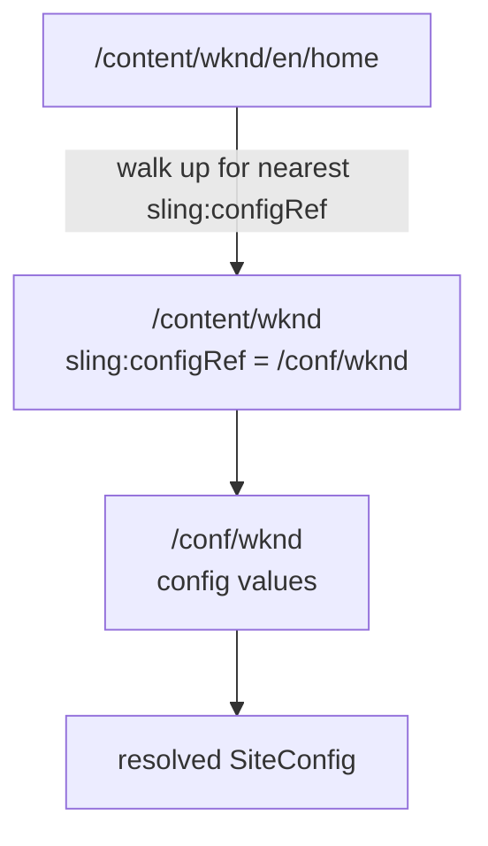

export const meta = {
  order: 1,
  num: '01',
  title: 'What is Context-Aware Configuration?',
  topics: 'configuration by content context · /conf · vs OSGi config'
};

**Context-Aware Configuration** (CAC) lets configuration vary by *where you are in the content tree* —
so a brand, region or site can each have different settings, chosen automatically by the page's
location.

## The problem it solves

OSGi configuration is **global per instance** (optionally per run mode). But "the social-media links",
"the API key for this brand", or "is the newsletter signup on?" should differ **per site**, set by
authors/admins — not by a developer redeploying.

CAC resolves configuration by walking up from the current resource to find the nearest configured
value.

## How context is established

A content tree is associated with a configuration bucket via a **`sling:configRef`** property
(usually on the site root), pointing into **`/conf`**:

```text
/content/wknd        → sling:configRef = /conf/wknd
/conf/wknd/sling:configs/...        ← the actual config values live here
```

Resolve a config for `/content/wknd/en/home` and CAC finds `/conf/wknd`'s values. A sub-site can point
at its own `/conf` and **override**.



## CAC vs OSGi config

| | OSGi config | Context-Aware config |
|---|---|---|
| Scope | whole instance (or run mode) | per content context (`/conf`) |
| Edited by | developers (deploy) / admins (console) | authors/admins, per site |
| Lives in | `/apps` config / console | `/conf` |
| Use for | endpoints, technical settings | per-site/brand business settings |

<Callout type="do">Reach for CAC when a setting should differ **per site/brand/region** and be owned by authors. Keep technical, instance-wide settings (timeouts, endpoints) in **OSGi** config.</Callout>
