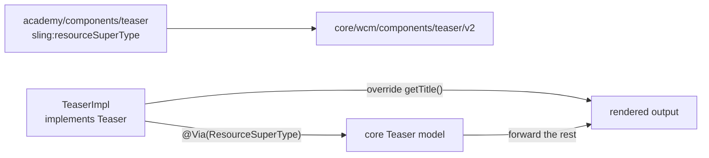

export const meta = {
  order: 1,
  num: '01',
  title: 'Reusing Core Component Models (Delegation)',
  topics: 'sling:resourceSuperType · the delegation pattern · @Via ResourceSuperType · model composition'
};

Adobe's **Core Components** already ship battle-tested Sling Models (Title, Image, Teaser, List…).
When you need a *slightly* different behaviour, you **reuse** their model and override only the bit
you care about — instead of re-implementing everything.

## Step 1 — inherit the component

Point your component at the core component with **`sling:resourceSuperType`**, so you inherit its HTL,
dialog and model for free:

```xml
<!-- /apps/academy/components/teaser/.content.xml -->
<jcr:root jcr:primaryType="cq:Component"
    jcr:title="Teaser"
    sling:resourceSuperType="core/wcm/components/teaser/v2/teaser"/>
```

## Step 2 — the delegation pattern

Adobe's recommended **delegation pattern**: your model *implements the core interface*, injects the
core model as a **delegate** via `@Via(ResourceSuperType.class)`, and forwards everything except your
override:

```java
@Model(
  adaptables = SlingHttpServletRequest.class,
  adapters = { Teaser.class, ComponentExporter.class },
  resourceType = "academy/components/teaser",
  defaultInjectionStrategy = DefaultInjectionStrategy.OPTIONAL)
@Exporter(name = "jackson", extensions = ExporterConstants.SLING_MODEL_EXTENSION)
public class TeaserImpl implements Teaser {

  @Self @Via(type = ResourceSuperType.class)
  private Teaser delegate;          // the core Teaser model

  @Override
  public String getTitle() {        // the ONE thing we change
    return StringUtils.upperCase(delegate.getTitle());
  }

  @Override                          // everything else: just forward
  public String getDescription() { return delegate.getDescription(); }
}
```

`@Via(ResourceSuperType.class)` tells Sling Models to adapt against the **super-type's** resource, so
`delegate` is the real core Teaser model — fully wired.



## Why this is "model composition"

You compose your model *from* the core model rather than inheriting Java code. You get all of Adobe's
maintenance and accessibility work, override the minimum, and still export the core JSON contract
(`ComponentExporter`) for SPA/headless.

<Callout type="do">Reuse before you rebuild. Set `sling:resourceSuperType`, delegate via `@Via(ResourceSuperType.class)`, and override only what differs — your component stays tiny and rides Core Component upgrades.</Callout>

<Callout type="warn">Match the core model's **adaptable and adapters** (request-adaptable, `Teaser.class` + `ComponentExporter.class`) and keep the `resourceType` correct — otherwise your model won't be selected over the inherited one.</Callout>
