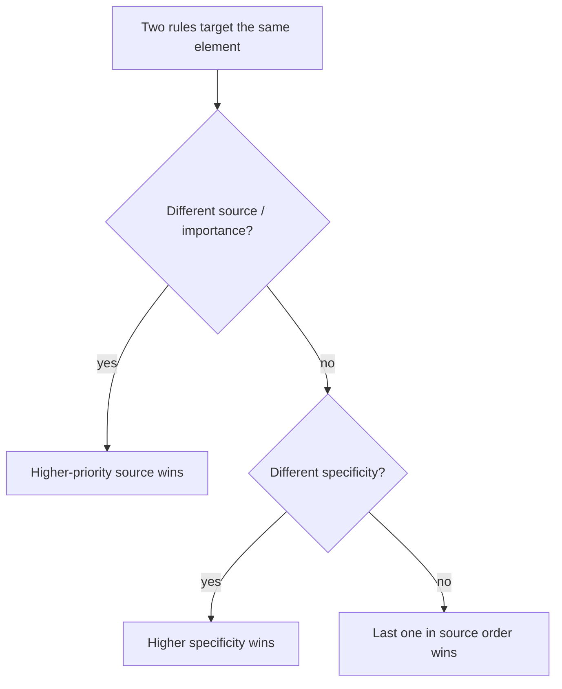

export const meta = {
  order: 1,
  num: '01',
  title: "What's CSS",
  topics: 'Anatomy of a rule · the cascade · sources · how a winner is chosen'
};

**CSS** = **Cascading Style Sheets**. It's how we tell the browser how elements should look.

## Anatomy of a rule

```css
h1 {                 /* selector  */
  font-size: 20px;   /* declaration: property + value */
  line-height: 24px;
}
```

A **rule** is a *selector* plus a block of *declarations*. Each declaration is a
`property: value;` pair.

## Why "cascading"?

When more than one rule targets the same element, the **cascade** decides which value wins —
and it's predictable. Four things determine the outcome, in order:

1. **Source & importance** — where the rule comes from
2. **Specificity** — how targeted the selector is (next lesson)
3. **Order** — later rules beat earlier ones of equal specificity
4. **Inheritance** — some properties pass down to children when nothing else applies

<Callout type="note">"Cascading" is the priority scheme for resolving conflicts. Knowing it is the difference between fixing CSS and *cursing at* CSS.</Callout>

## Sources (lowest → highest priority)

| Source | Who sets it |
|---|---|
| **User-agent** | the browser's defaults |
| **User** | the visitor (accessibility settings) |
| **Author** | you, the developer |

Author styles normally win over user-agent defaults — which is why a `<h1>` you style looks the
way you wrote it, not the browser's default.



## Inheritable properties

Some properties (mostly typography: `color`, `font-family`, `line-height`) **inherit** to
descendants. Most layout properties (`margin`, `border`, `width`) do **not**.

```css
body { color: #333; }   /* every descendant text is #333 unless overridden */
```

<Callout type="do">Before debugging "why is this style not applied?", ask: which source, what specificity, and what order? That's the cascade.</Callout>
