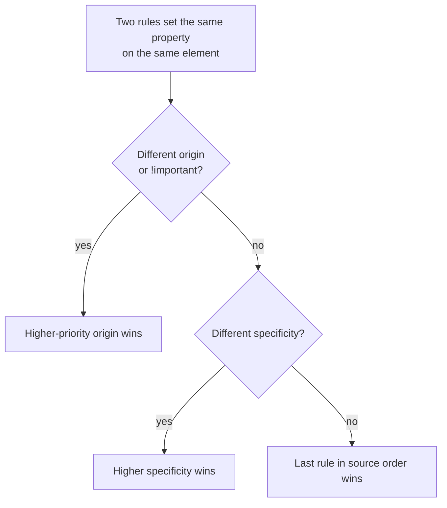

export const meta = {
  order: 1,
  num: '01',
  title: "What's CSS",
  topics: 'Anatomy of a rule · the cascade · sources · how a winner is chosen'
};

**CSS** = **Cascading Style Sheets**. It's how we tell the browser how elements should look.

## Anatomy of a rule

```css
h1 {                 /* selector  */
  font-size: 20px;   /* declaration: property + value */
  line-height: 24px;
}
```

A **rule** is a *selector* plus a block of *declarations*. Each declaration is a
`property: value;` pair.

## Why "cascading"?

When more than one rule sets the **same property** on the **same element**, the **cascade** picks
the winner — predictably. It checks four things, in order:

1. **Source & importance** — where the rule comes from (origin, and `!important`)
2. **Specificity** — how targeted the selector is (next lesson)
3. **Order** — among rules of equal specificity, the **later** one wins
4. **Inheritance** — if nothing targets the element, some properties fall back to the parent's value

```css
/* Three rules set `color` on the same <p>. The cascade resolves the conflict: */
p     { color: gray; }          /* type selector — weakest        */
.note { color: teal; }          /* class beats a type selector    */
#x    { color: rebeccapurple; } /* id beats a class  →  this wins  */
```

The browser walks the checks top to bottom and stops at the first one that separates the rules:



<Callout type="note">"Cascading" is the priority scheme for resolving conflicts. Knowing it is the difference between fixing CSS and *cursing at* CSS.</Callout>

## Sources (lowest → highest priority)

| Source | Who sets it |
|---|---|
| **User-agent** | the browser's defaults |
| **User** | the visitor (accessibility settings) |
| **Author** | you, the developer |

Author styles normally win over user-agent defaults — which is why a `<h1>` you style looks the
way you wrote it, not the browser's default.

## Inheritable properties

Some properties (mostly typography: `color`, `font-family`, `line-height`) **inherit** to
descendants. Most layout properties (`margin`, `border`, `width`) do **not**.

```css
body { color: #333; }   /* every descendant text is #333 unless overridden */
```

Three rules target the same element — comment one out to see the cascade pick a different winner:

<Playground
  html={`<p id="x" class="note">Which color wins?</p>`}
  css={`p     { color: gray; }           /* type     → 0,0,0,1 */
.note { color: teal; }           /* class    → 0,0,1,0 */
#x    { color: rebeccapurple; }  /* id       → 0,1,0,0  → wins */`}
/>

<Callout type="do">Before debugging "why is this style not applied?", ask: which source, what specificity, and what order? That's the cascade.</Callout>
