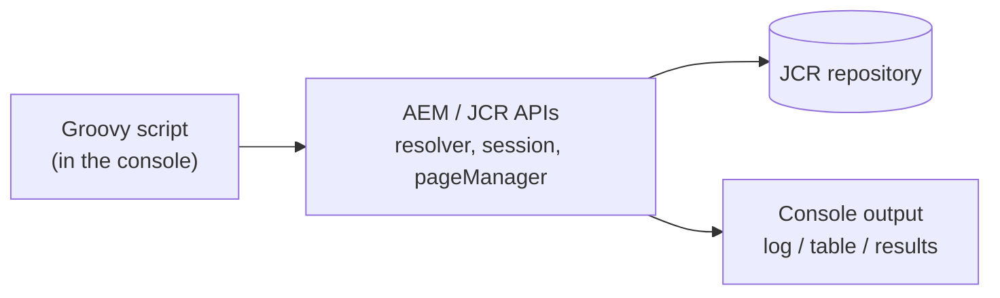

export const meta = {
  order: 1,
  num: '01',
  title: 'Groovy & the AEM Groovy Console',
  topics: 'what Groovy is · installing the console · running a script safely'
};

The **AEM Groovy Console** lets you run Groovy scripts *inside* a running AEM instance — perfect for
one-off content migrations, bulk fixes, and exploring the repository, without writing/deploying a
servlet.

## Why Groovy here

Groovy is a JVM language that reads like simplified Java — it runs against the **same AEM APIs**
(`ResourceResolver`, `Session`, `PageManager`) but with concise syntax, optional types, and closures.
You write a script, run it, see the output immediately.



## Install the console

It's an open-source package (`aem-groovy-console`). Add it to your project (embedded in `all`) or, for
local use, upload the release package via **Package Manager**. After install it's at:

```text
/apps/groovyconsole  →  open via the AEM tools, or /groovyconsole.html
```

<Callout type="warn">The Groovy Console runs **arbitrary code as a powerful user** — it can modify or delete anything. Install it on **lower environments** (local/dev), restrict access tightly, and **never** leave it open on production/publish. Treat it like root shell access.</Callout>

## The bindings you get for free

The console pre-binds the objects you need, so a script can start working immediately:

| Binding | What |
|---|---|
| `resourceResolver` | a `ResourceResolver` (admin-ish, current user) |
| `session` | the JCR `Session` |
| `pageManager` | the `PageManager` |
| `getPage(path)` | helper to fetch a `Page` |
| `save()` / `session.save()` | persist changes |

<Callout type="do">Always **read first, write second**: run a script that only logs what it *would* change, eyeball the output, then add the write + `save()`. The console makes destructive changes trivially easy — slow down on writes.</Callout>
