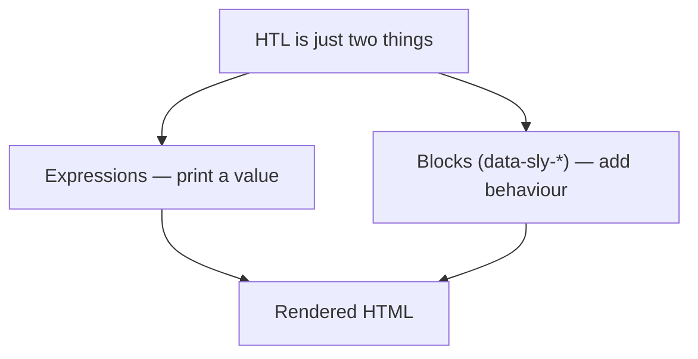

export const meta = {
  order: 1,
  num: '01',
  title: 'Blocks, Tags & the data-sly Element',
  topics: 'Blocks &amp; expressions · the <code>&lt;sly&gt;</code> tag · <code>data-sly-element / text / attribute / test</code>'
};

HTL has exactly two building blocks: **expressions** that print values, and **blocks**
(the `data-sly-*` attributes) that add behaviour to the element they sit on. There is no
third syntax — everything else is plain HTML.



## 1 · Expression — print a value

An expression is written `${ … }` and outputs a value, escaped for its context.

<Tabs>
<Tab label="Code">

```html
<!--/* given: properties.headline = "Weaving Algorithms" */-->
<h3>${properties.headline}</h3>
```

</Tab>
<Tab label="Result">

With `headline = "Weaving Algorithms"`:

<h3>Weaving Algorithms</h3>

</Tab>
</Tabs>

## 2 · The `<sly>` tag

When you need a block but don't want a wrapper element in the output, host it on `<sly>`.
HTL consumes the tag — it never appears in the HTML.

```html
<sly data-sly-use.model="com.example.MyModel"></sly>
```

<Callout type="do">Use <code>&lt;sly&gt;</code> for pure logic so you don't pollute the markup with empty <code>&lt;div&gt;</code>s.</Callout>
<Callout type="dont">Don't add a <code>&lt;div data-sly-unwrap&gt;</code> just to strip a wrapper — <code>&lt;sly&gt;</code> exists for exactly that and reads clearer.</Callout>

<Callout type="when">**When to use it** — whenever a block's behaviour is needed but a wrapper element would be wrong: declaring `data-sly-use` at the top of a file, or putting conditional/looped logic inside a `<table>`, `<ul>`, or `<select>` where an extra `<div>` would break the layout or HTML validity. Use `<sly>` by default; use `data-sly-unwrap` to *conditionally* drop an element you sometimes do want.</Callout>

## 3 · `data-sly-element` — swap the tag name

<Tabs>
<Tab label="Code">

```html
<h1 data-sly-element="h3">Rendered as an h3</h1>
```

</Tab>
<Tab label="Result">

Authored as `<h1>`, rendered as `<h3>`:

<h3>Rendered as an h3</h3>

</Tab>
<Tab label="When to use it">

**The business problem.** SEO and accessibility need a correct heading hierarchy — one `<h1>`
per page, then `<h2>`/`<h3>` nested in order. But the *visual* size of a title is a design
choice, unrelated to its place in that hierarchy. So an author must be able to drop a title and
choose its **semantic level** independently of how it looks.

**Why reach for `data-sly-element`.** The tag name itself must be dynamic — and a tag name isn't
something you can set with a normal attribute or expression. `data-sly-element` is the only block
that swaps the *element* based on data.

```html
<sly data-sly-use.title="biz.netcentric.academy.core.models.title.TitleModel"/>
<h2 class="title__text" data-sly-element="${title.type}">${title.text}</h2>
```

Author picks **H1** in the dialog → the page gets a real `<h1>`; switch to **H3** → the *same*
component renders an `<h3>`, same CSS class, same styling.

**When you'll need it in practice:**

- A **Title / Heading** component with an author-selectable level (the classic case).
- Rendering a list as `<ul>` *or* `<ol>` from a "list type" option.
- A wrapper that should be a `<section>`, `<article>`, or `<div>` depending on context.
- Any component where the *semantic element* — not just its content or attributes — is configurable.

<Callout type="dont">Without `data-sly-element` you'd branch per tag — six near-identical blocks that drift out of sync:</Callout>

```html
<h1 data-sly-test="${title.type == 'h1'}">${title.text}</h1>
<h2 data-sly-test="${title.type == 'h2'}">${title.text}</h2>
<!-- …and so on for h3–h6 -->
```

<Callout type="note">This is exactly how the project's <code>title</code> component works — the dialog stores <code>./type</code>, the model exposes it, and one <code>data-sly-element</code> keeps the markup DRY.</Callout>

</Tab>
</Tabs>

## 4 · `data-sly-text` — replace the content

<Tabs>
<Tab label="Code">

```html
<!--/* given: properties.headline = "Weaving Algorithms" */-->
<p data-sly-text="${properties.headline}">placeholder</p>
```

</Tab>
<Tab label="Result">

The literal "placeholder" is replaced by the expression:

<p>Weaving Algorithms</p>

</Tab>
<Tab label="When to use it">

When an element's content is data-driven but you want a real **placeholder** left in the template,
so the static HTML still previews and designers see sample copy. It also marks the binding
declaratively ("this text is dynamic") and keeps the expression out of the content flow when the
element also carries classes or other blocks.

</Tab>
</Tabs>

## 5 · `data-sly-attribute` — set attributes dynamically

<Tabs>
<Tab label="Code">

```html
<!--/* given: properties.url = "https://github.com/Netcentric/aem-htl-style-guide" */-->
<a data-sly-attribute.href="${properties.url}">Style Guide</a>
```

</Tab>
<Tab label="Result">

A null/empty value removes the attribute — no `href=""` left behind:

<a href="https://github.com/Netcentric/aem-htl-style-guide">Style Guide</a>

</Tab>
<Tab label="When to use it">

When an attribute's value *or presence* is data-driven and an empty value must make the attribute
disappear: an optional `href`/`target` on a link, a `src` that mustn't render as `src=""`,
conditional `aria-*` attributes, or a `title` only shown when authored. Also when you need to set
several attributes at once (pass a map) or the attribute *name* itself is dynamic.

</Tab>
</Tabs>

## 6 · `data-sly-test` — render conditionally

```html
<p data-sly-test="${properties.showAdvanced}">Visible only when true</p>
```

You can also capture the result: `data-sly-test.hasX="${…}"` assigns `hasX` for reuse later.

<Callout type="when">**When to use it** — to render markup *only when it makes sense*: skip the whole image block when no image is authored, hide an empty-state, gate a CTA behind "has both a label and a link", or switch between author and publish output. Capturing the test (`data-sly-test.hasImage`) lets you evaluate a condition once and reuse it, keeping the template readable and avoiding empty wrappers in the output.</Callout>

## 🧪 Try it in the HTL REPL

```html
<sly data-sly-test.greeting="${'Hello, KBC!'}"/>
<h1 data-sly-element="${'h3'}">${greeting}</h1>
<div data-sly-unwrap>This text has no wrapper element.</div>
<a data-sly-attribute.href="${'https://adobe.com'}">A link</a>
<p data-sly-test="${greeting}">Shown — greeting is truthy (test variable reused).</p>
```

<ReplLink />
