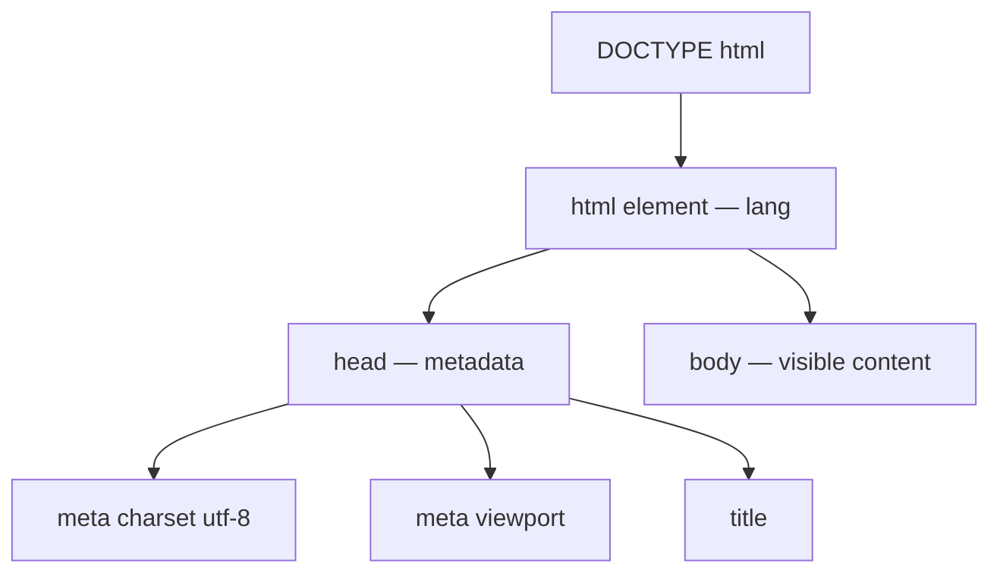

export const meta = {
  order: 1,
  num: '01',
  title: 'HTML Fundamentals',
  topics: 'Doctype · the HTML5 skeleton · encoding · language · viewport'
};

HTML is the **structure and content** layer of the web. CSS adds presentation, JavaScript adds
behaviour — but HTML comes first, and a page works (and is accessible) on HTML alone.

## The minimal HTML5 document

```html
<!DOCTYPE html>
<html lang="en">
  <head>
    <meta charset="utf-8" />
    <meta name="viewport" content="width=device-width, initial-scale=1" />
    <title>My Page</title>
  </head>
  <body>
    <h1>Hello, world</h1>
  </body>
</html>
```



## The five things every document needs

- **`<!DOCTYPE html>`** — must be the very first line. It switches the browser into modern
  ("standards") mode. It is **not** an HTML tag — just a required declaration.
- **`<html lang="en">`** — the root element. The `lang` attribute tells browsers, screen readers,
  and search engines the page language (affects pronunciation, hyphenation, translation).
- **`<meta charset="utf-8">`** — the character encoding. Always UTF-8, and put it **first** in the
  `<head>` so the browser decodes the rest correctly (accents, emoji, symbols).
- **`<meta name="viewport" …>`** — makes the page responsive on mobile; without it, phones render
  at a zoomed-out desktop width.
- **`<title>`** — the tab/bookmark label and a major SEO signal.

## head vs body

- **`<head>`** — metadata *about* the page: title, encoding, viewport, links to CSS, scripts.
  Nothing here is visible in the page itself.
- **`<body>`** — everything the user sees and interacts with.

<Callout type="do">Start every project from this exact skeleton. The `charset`, `viewport`, and `lang` lines are not optional boilerplate — each one fixes a real rendering or accessibility problem.</Callout>

<Callout type="note">HTML5 is forgiving — browsers will render messy markup — but "it renders" isn't "it's correct". The rest of this track is about writing HTML that is structured, accessible, and valid.</Callout>
