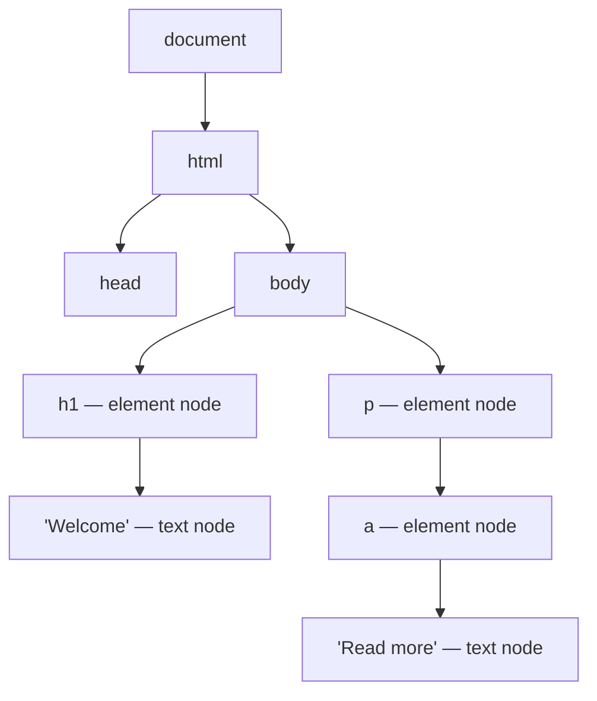

export const meta = {
  order: 2,
  num: '02',
  title: 'The DOM & Attributes',
  topics: 'The node tree · elements, attributes, values · global &amp; boolean attributes · data-*'
};

A browser parses your HTML into a **tree of nodes** — the **DOM** (Document Object Model). Every
tag becomes an *element node*; text becomes *text nodes*; attributes hang off element nodes. CSS
selects nodes, and JavaScript reads and changes them.



## Anatomy of an element

```html
<a href="/docs" class="link">Read more</a>
```

- **Tag**: `a` (opening `<a>` … closing `</a>`)
- **Attributes**: `href="/docs"`, `class="link"` — always `name="value"`, value quoted
- **Content**: the text/children between the tags

Nesting creates parent → child → sibling relationships. **Close tags in the order you opened
them** — overlapping tags (`<b><i></b></i>`) are invalid.

## Void (empty) elements

Some elements have **no content and no closing tag** — they're self-contained:

```html
<meta charset="utf-8">

<br>
<input type="text">
<hr>
```

## Global attributes (work on any element)

| Attribute | Purpose |
|---|---|
| `id` | unique identifier (one per page) |
| `class` | one or more class names (styling/JS hooks) |
| `title` | advisory tooltip text |
| `lang` | language of this element's content |
| `hidden` | hides the element |
| `tabindex` | keyboard focus order |
| `style` | inline CSS (use sparingly) |
| `data-*` | your own custom data |

## Boolean attributes

Present = true, absent = false. Their value doesn't matter — just being there enables them:

```html
<input type="checkbox" checked>
<button disabled>Can't click</button>
<input required>
```

## `data-*` — your own attributes

Attach custom data to an element without abusing `class` or `id`. Read it in CSS
(`[data-state="open"]`) or JS (`el.dataset.state`):

```html
<button data-action="open" data-id="42">Open</button>
```

<Callout type="note">In AEM front-ends this is exactly how the component loader works — `data-nc="MyComponent"` and `data-nc-params-…` carry behaviour and config to JavaScript. (See the JavaScript track.)</Callout>

## Block vs inline (the old mental model)

Historically elements were "block" (start on a new line, take full width — `div`, `p`, `section`)
or "inline" (flow within text — `span`, `a`, `strong`). CSS can override this with `display`, but
the **default content model** still guides what may nest where (e.g. you can't put a `<div>`
inside a `<p>`).

<Callout type="do">Pick elements for their **meaning**, then style with CSS. The DOM you produce is what assistive tech, search engines, and your JavaScript all read.</Callout>
