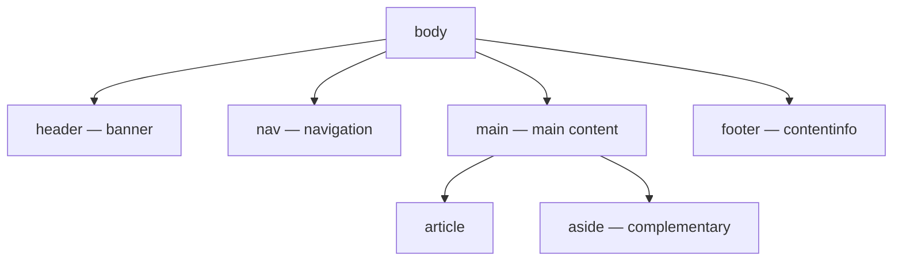

export const meta = {
  order: 3,
  num: '03',
  title: 'Semantic HTML & Document Outline',
  topics: 'header / nav / main / article / section / aside / footer · heading hierarchy h1–h6'
};

**Semantic** HTML uses elements for their *meaning*, not their appearance. It's the single
highest-leverage habit in front-end: you get accessibility, SEO, and maintainability for free.

## Landmark elements



| Element | Use for |
|---|---|
| `<header>` | introductory content / page or section masthead |
| `<nav>` | a block of navigation links |
| `<main>` | the primary content — **one per page** |
| `<article>` | a self-contained, independently distributable unit (blog post, card, comment) |
| `<section>` | a thematic grouping, usually with a heading |
| `<aside>` | tangential content (sidebars, callouts, related links) |
| `<footer>` | closing content (copyright, links) for a page or section |

```html
<body>
  <header>…site logo + masthead…</header>
  <nav>…primary menu…</nav>
  <main>
    <article>
      <h1>Article title</h1>
      <section><h2>A part</h2>…</section>
      <aside>Related links</aside>
    </article>
  </main>
  <footer>© 2026</footer>
</body>
```

<Callout type="dont">"Div soup" — everything is a `<div>`, meaning is carried only by class names:
`<div class="header">` `<div class="nav">` `<div class="main">`. Screen readers and crawlers see nothing but boxes.</Callout>
<Callout type="do">Use the landmark that matches the role. They become **navigable landmarks** for screen-reader users and are understood by search engines out of the box.</Callout>

Edit the markup — the same semantic regions, lightly styled so you can see the structure:

<Playground
  html={`<header>Header / banner</header>
<nav>Nav: Home · Guides · Shop</nav>
<main>
  <article>
    <h1>Article title</h1>
    <p>The main content lives here.</p>
  </article>
  <aside>Related links</aside>
</main>
<footer>© 2026</footer>`}
  css={`header, nav, main, article, aside, footer {
  padding: .6rem .8rem;
  margin: .3rem 0;
  border-radius: 6px;
}
header { background: #6b2fb3; color: #fff; }
nav    { background: #ece6f6; }
main   { display: flex; gap: .5rem; }
article{ background: #f7f7fb; flex: 1; }
aside  { background: #fbf3da; width: 32%; }
footer { background: #1c1c28; color: #fff; }`}
/>

## Heading hierarchy (h1–h6)

Headings form the document **outline** — the table of contents assistive tech and search engines
build. Rules:

- **One `<h1>`** per page (or per `<article>`): the main title.
- **Don't skip levels** for styling — `<h1>` → `<h2>` → `<h3>`, not `<h1>` → `<h4>`.
- Choose the level by **structure**, then size it with CSS (this is the `data-sly-element` use
  case in the HTL track — semantic level decoupled from visual size).

<Tabs>
<Tab label="Code">

```html
<!-- Headings are siblings in the flow — NOT nested. The level (1–6),
     not indentation, expresses the outline. -->
<h1>Coffee guide</h1>
<h2>Brewing methods</h2>
<h3>Pour-over</h3>
<h3>French press</h3>
<h2>Storage</h2>
```

</Tab>
<Tab label="Result">

<h3 style={{margin:'.2rem 0'}}>Coffee guide</h3>
<div style={{paddingLeft:'1rem'}}>Brewing methods → Pour-over, French press</div>
<div style={{paddingLeft:'1rem'}}>Storage</div>

A clean outline: one title, then nested sub-topics — no skipped levels.

</Tab>
</Tabs>

<Callout type="note">Try the **headingsMap** browser extension or your dev-tools accessibility tree to *see* your outline. If it doesn't read like a sensible table of contents, the structure is wrong.</Callout>
