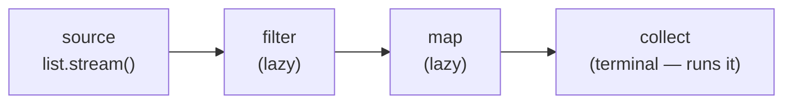

export const meta = {
  order: 3,
  num: '03',
  title: 'The Streams API',
  topics: 'pipelines · map/filter/collect · intermediate vs terminal · laziness & pitfalls'
};

Streams express *what* to do with a sequence of elements, not *how* to loop. They make AEM model code
that transforms child resources or search results far more readable.

## A pipeline: source → intermediate ops → terminal op

```java
List<String> titles = resources.stream()        // source
    .filter(r -> r.isResourceType("academy/components/card"))  // intermediate
    .map(r -> r.getValueMap().get("jcr:title", String.class))  // intermediate
    .filter(Objects::nonNull)
    .collect(Collectors.toList());               // terminal
```



- **Intermediate** ops (`filter`, `map`, `sorted`, `distinct`, `limit`) return a stream and are **lazy**.
- **Terminal** ops (`collect`, `forEach`, `count`, `findFirst`, `reduce`) trigger execution and produce a result.

Nothing runs until the terminal op — so an intermediate-only pipeline does *nothing*.

## Common shapes

```java
// to a Map
Map<String, Resource> byName = list.stream()
    .collect(Collectors.toMap(Resource::getName, r -> r));

// grouping
Map<String, List<Lesson>> byTrack = lessons.stream()
    .collect(Collectors.groupingBy(Lesson::getTrack));

// any/all + reduce
boolean hasImage = list.stream().anyMatch(r -> r.getChild("image") != null);
int total = prices.stream().mapToInt(Integer::intValue).sum();
```

## `Optional` pairs naturally with streams

`findFirst()` / `max()` return an `Optional` — handle "nothing matched" explicitly instead of risking
an NPE:

```java
return resources.stream()
    .filter(Resource::isResourceType)         // some predicate
    .findFirst()
    .map(Resource::getName)
    .orElse("default");
```

<Callout type="warn">Pitfalls: streams are **single-use** (a stream can't be reused after a terminal op); don't mutate external state from a lambda (no side effects in `map`/`filter`); and don't reach for `parallelStream()` in AEM request handling — the overhead rarely pays off and it can starve thread pools.</Callout>

<Callout type="do">Use streams for **transform/filter/aggregate**. For a plain side-effecting loop, an enhanced `for` is clearer than `forEach` — readability first.</Callout>
