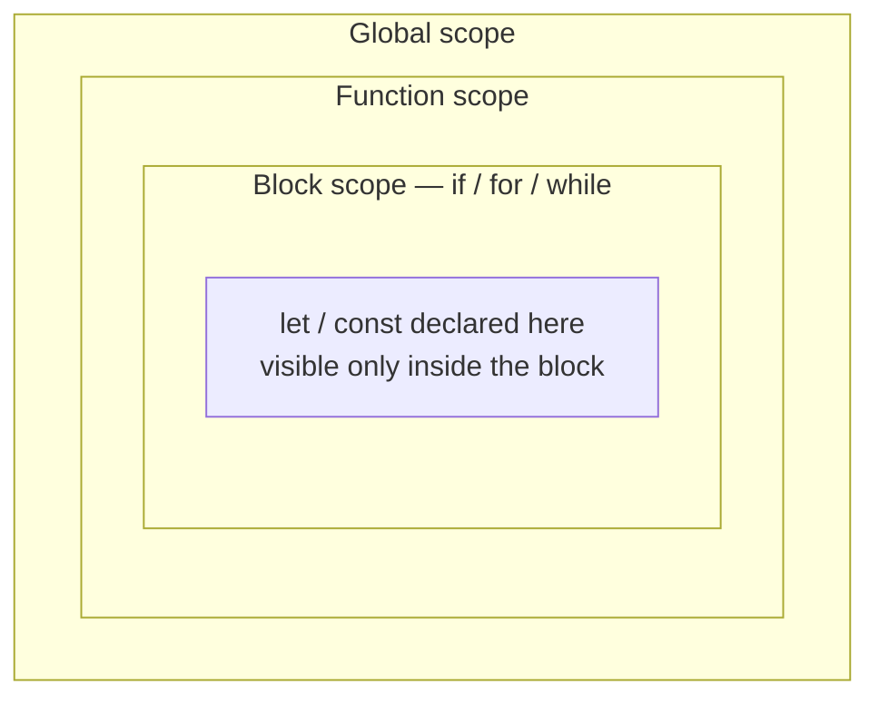

export const meta = {
  order: 1,
  num: '01',
  title: 'JavaScript Basics',
  topics: 'Variables · scope · types · operators · control flow · functions · classes'
};

JavaScript adds interactivity to a website. The language core is compact; on top of it sit
browser APIs, third-party APIs, and frameworks.

## Variables & constants

Declare with `let` or `const` (avoid `var`). Assign, then optionally reassign.

```js
let name = 'John';       // declare + assign
name = 'Bob';            // ok

const id = 42;           // can't be reassigned
// id = 7;               // TypeError

const list = [];         // the binding is constant, the contents aren't
list.push('hello');      // ['hello']  ← fine
```

<Callout type="do">Default to `const`; use `let` only when you must reassign. Never `var`.</Callout>

## Scope

- **Global** — accessible everywhere
- **Function** — visible only inside the function
- **Block** — `let`/`const` inside `{ }` (if, for, while) are visible only in that block

**Lexical scope:** an inner function can read variables from its enclosing scope.



Inner scopes can read outward; outer scopes cannot read in.

```js
const name = 'John';
function outer() {
  const surname = 'Wick';
  // inner can see name + surname
  return `${name} ${surname}`;
}
// surname is NOT visible out here
```

## Data types

`String`, `Number`, `Boolean`, `Array`, and `Object` (functions, DOM nodes — everything else — are objects).

## Operators

```js
6 + 9;            // 15      (also string concat: 'a' + 'b')
20 / 2;           // 10
let n = 4;
n === 3;          // false   (strict equality)
n !== 3;          // true
```

## Control flow & loops

```js
if (food === 'ice cream') { /* … */ } else { /* … */ }

for (let i = 0; i < 5; i++) { /* runs 5 times */ }
```

Also: `switch`, `while`, `do…while`, `for…of` (values), `for…in` (keys), and
`return` / `break` / `continue`.

## Functions

```js
function sum(a, b) { return a + b; }
sum(3, 5); // 8
```

## Classes & `this`

A **class** is a blueprint for creating objects. Each object you build from it is an **instance**.
Use a class when you have several things that share the same shape and behaviour — like every
component on a page.

```js
class Greeter {
  // The constructor runs once, when you create an instance with `new`.
  // It sets up the instance's starting data (its "state").
  constructor(name) {
    this.name = name;        // store a property ON this instance
  }

  // A method — a function that belongs to the class.
  greet() {
    console.log(`Hello ${this.name}`);
  }
}

const g = new Greeter('World'); // `new` builds an instance and runs the constructor
g.greet();                      // Hello World
```

Three words to be clear on:

- **`new`** — creates a fresh, empty instance and runs the `constructor`.
- **property** (`this.name`) — a piece of data stored on the instance. **method** (`greet`) — a
  function the instance can run.
- **`this`** — inside the class, `this` refers to **the specific instance you're working with**.
  Each instance has its own.

### `this` is per-instance

Make two instances and `this.name` is different in each — the methods are shared, the data is not:

```js
const a = new Greeter('Ada');
const b = new Greeter('Linus');

a.greet(); // Hello Ada
b.greet(); // Hello Linus
```

<Callout type="warn">**The classic `this` gotcha.** When you pass a method as a callback, it can lose its `this`:

```js
button.addEventListener('click', g.greet);   // ❌ inside greet, `this` is no longer `g`
```

Fix it with an **arrow function** (arrows keep the surrounding `this`) or `.bind`:

```js
button.addEventListener('click', () => g.greet());  // ✅
button.addEventListener('click', g.greet.bind(g));  // ✅
```
</Callout>

<Callout type="note">This is exactly how the components in the next lessons work: each one is a **class**, and the loader creates an **instance** per element with `new MyComponent(element, options)` — so `this.element` is *that* element, and every component keeps its own state.</Callout>

## Events (a first look)

```js
const button = document.querySelector('.button');
button.addEventListener('click', () => console.log('clicked'));
```

<Callout type="note">These fundamentals power everything in the next lessons — especially classes + events, which the Netcentric component pattern is built on.</Callout>
