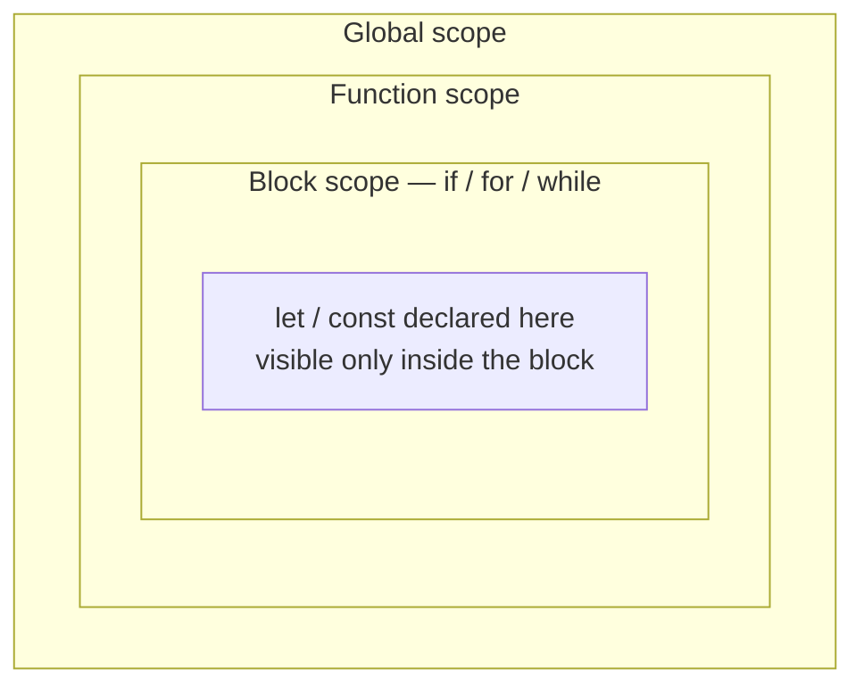

export const meta = {
  order: 1,
  num: '01',
  title: 'JavaScript Basics',
  topics: 'Variables · scope · types · operators · control flow · functions'
};

JavaScript adds interactivity to a website. The language core is compact; on top of it sit
browser APIs, third-party APIs, and frameworks.

## Variables & constants

Declare with `let` or `const` (avoid `var`). Assign, then optionally reassign.

```js
let name = 'John';       // declare + assign
name = 'Bob';            // ok

const id = 42;           // can't be reassigned
// id = 7;               // TypeError

const list = [];         // the binding is constant, the contents aren't
list.push('hello');      // ['hello']  ← fine
```

<Callout type="do">Default to `const`; use `let` only when you must reassign. Never `var`.</Callout>

## Scope

- **Global** — accessible everywhere
- **Function** — visible only inside the function
- **Block** — `let`/`const` inside `{ }` (if, for, while) are visible only in that block

**Lexical scope:** an inner function can read variables from its enclosing scope.



Inner scopes can read outward; outer scopes cannot read in.

```js
const name = 'John';
function outer() {
  const surname = 'Wick';
  // inner can see name + surname
  return `${name} ${surname}`;
}
// surname is NOT visible out here
```

## Data types

A few **primitives**, plus **objects** for everything structured:

```js
const title   = 'Hello';                 // String   — text
const price    = 42;                      // Number   — ints & floats (one number type)
const inStock  = true;                    // Boolean  — true / false
const nothing  = null;                    // null     — an intentional "no value"
let   notSet;                             // undefined — declared but not assigned

const tags     = ['new', 'sale'];         // Array    — an ordered list
const user     = { name: 'Ada', age: 36 }; // Object   — key/value pairs
```

Everything that isn't a primitive is an **object** — arrays, functions, and DOM nodes included.
Check a value's type with `typeof`:

```js
typeof title;    // 'string'
typeof price;    // 'number'
typeof inStock;  // 'boolean'
typeof notSet;   // 'undefined'
typeof tags;     // 'object'   (arrays are objects)
typeof user;     // 'object'
typeof null;     // 'object'   (a long-standing quirk)
```

## Operators

```js
6 + 9;            // 15      (also string concat: 'a' + 'b')
20 / 2;           // 10
let n = 4;
n === 3;          // false   (strict equality)
n !== 3;          // true
```

## Control flow & loops

```js
if (food === 'ice cream') { /* … */ } else { /* … */ }

for (let i = 0; i < 5; i++) { /* runs 5 times */ }
```

Also: `switch`, `while`, `do…while`, `for…of` (values), `for…in` (keys), and
`return` / `break` / `continue`.

## Functions

```js
function sum(a, b) { return a + b; }
sum(3, 5); // 8
```

## Events (a first look)

```js
const button = document.querySelector('.button');
button.addEventListener('click', () => console.log('clicked'));
```

Run it yourself — **click the button** and watch the console:

<Playground
  html={`<button class="btn">Click me</button>`}
  js={`const button = document.querySelector('.btn');
let count = 0;

button.addEventListener('click', () => {
  count += 1;
  console.log('clicked ' + count + ' time(s)');
});`}
/>

<Callout type="note">These fundamentals power everything that follows. Next up: **classes, `this` & `bind`** — the backbone of the Netcentric component pattern.</Callout>
