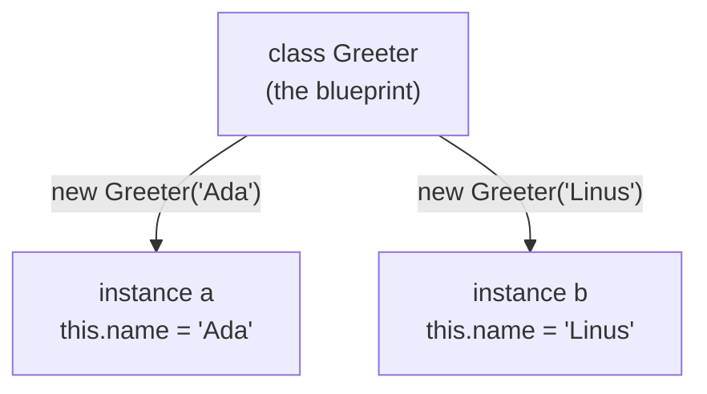

export const meta = {
  order: 2,
  num: '02',
  title: 'Classes, this & bind',
  topics: 'class · constructor · methods · instances · this · losing this · bind'
};

Every Netcentric component is a **class**, so this is the one concept to get really comfortable with.
We'll build it up slowly — what a class is, what `this` means, and why you'll sometimes need `bind`.

## Why a class?

A **class** is a *blueprint* for making objects. You describe the shape and behaviour once, then stamp
out as many **instances** as you need — each with its own data. Think of one `Dropdown` class and ten
dropdowns on a page: same code, ten independent instances.



## Step 1 — your first class

```js
class Greeter {
  // The constructor runs ONCE, the moment you create an instance with `new`.
  // Its job: set up the instance's starting data (its "state").
  constructor(name) {
    this.name = name;          // store `name` ON this instance
  }

  // A method — a function that belongs to the class.
  greet() {
    console.log(`Hello ${this.name}`);
  }
}
```

Three words to be clear on:

- **`new`** — builds a fresh, empty object and runs the `constructor`.
- **property** — a piece of data on the instance (`this.name`).
- **method** — a function the instance can run (`greet`).

## Step 2 — create and use an instance

```js
const g = new Greeter('World'); // `new` builds the instance + runs the constructor
g.greet();                      // Hello World
```

`new Greeter('World')` does three things: makes a new empty object, runs `constructor('World')` with
`this` pointing at that new object, and hands it back to you.

## Step 3 — instances are independent

Make two and each keeps its **own** `name`. The methods are shared; the data is not:

```js
const a = new Greeter('Ada');
const b = new Greeter('Linus');

a.greet(); // Hello Ada
b.greet(); // Hello Linus
```

<Callout type="note">That independence is the whole point: the component loader does `new Dropdown(el)` once **per element**, so each dropdown keeps its own state and never interferes with the others.</Callout>

## Step 4 — what `this` actually is

Inside a method, **`this` is whatever is to the left of the dot when the method is called.**

```js
a.greet();   // left of the dot is `a` → this === a → "Hello Ada"
b.greet();   // left of the dot is `b` → this === b → "Hello Linus"
```

`this` isn't fixed when you *write* the class — it's decided **at call time**, by *how* the method is
called. That one sentence explains the gotcha below.

## Step 5 — the classic gotcha: losing `this`

When you pass a method somewhere as a **callback**, you detach it from its object. Now there's nothing
"to the left of the dot", so `this` is no longer the instance (it's `undefined` in strict mode):

```js
const g = new Greeter('Ada');

button.addEventListener('click', g.greet);   // ❌ `this` is lost → error / "Hello undefined"
```

`addEventListener` later calls the function on its own, like `greet()` — with no `g.` in front — so
inside `greet`, `this.name` blows up.

## Step 6 — three ways to keep `this`

```js
// 1) Arrow wrapper — call it the normal way (with `g.` in front), so `this` stays `g`
button.addEventListener('click', () => g.greet());

// 2) .bind(g) — lock `this` to g permanently (more on this next)
button.addEventListener('click', g.greet.bind(g));

// 3) Class field arrow method — auto-binds `this` to the instance (modern, common in components)
class Greeter {
  greet = () => { console.log(`Hello ${this.name}`); };
}
```

<Callout type="warn">Passing `obj.method` directly as a callback detaches it from `obj`. Wrap it in an arrow (`() => obj.method()`), use **`.bind(obj)`**, or define the method as a **class-field arrow** — otherwise `this` won't point at your instance.</Callout>

## `bind` — what it does and when to reach for it

`obj.method.bind(obj)` doesn't call the method. It returns a **brand-new function** whose `this` is
**permanently** locked to `obj`, no matter how it's later called.

```js
const greetAda = g.greet.bind(g);
greetAda();        // Hello Ada — `this` is locked to g forever
```

### Use case 1 — event handlers in a component

The everyday reason you'll use `bind`: handlers run on `this.element`, but the browser calls them
detached. Bind in the constructor so `this` still means the instance:

```js
class Dropdown {
  constructor(element) {
    this.element = element;
    this.open = false;
    // lock `this` so handleClick can use this.element / this.open
    this.element.addEventListener('click', this.handleClick.bind(this));
  }

  handleClick() {
    this.open = !this.open;            // `this` is the Dropdown instance ✅
    this.element.classList.toggle('is-open', this.open);
  }
}
```

### Use case 2 — being able to remove the listener later

This is the one beginners miss: **`.bind()` returns a *new* function every time you call it.** If you
want to `removeEventListener` later, you must bind **once** and keep the reference:

```js
class Dropdown {
  constructor(element) {
    this.element = element;
    this.onClick = this.handleClick.bind(this);   // store the bound function ONCE
    this.element.addEventListener('click', this.onClick);
  }
  destroy() {
    this.element.removeEventListener('click', this.onClick);  // same reference → removed ✅
  }
}
```

<Callout type="warn">`removeEventListener('click', this.handleClick.bind(this))` does **nothing** — that's a *different* function from the one you added. Same trap with an inline arrow. Save the bound/arrow function on `this` and reuse it.</Callout>

### Use case 3 — presetting arguments (partial application)

`bind`'s first argument is `this`; any extra arguments are **pre-filled**:

```js
function add(a, b) { return a + b; }
const add5 = add.bind(null, 5);    // `this` unused → null; a is fixed to 5
add5(10);                          // 15
```

<Callout type="do">In components, prefer a **class-field arrow** (`handleClick = () => {…}`) or **bind once in the constructor** and store the reference. Both keep `this` correct *and* give you a stable function you can remove later.</Callout>

## Try it — watch `this` get lost, then fixed

<Playground
  hideHtml
  html={`<p>Open the console below 👇</p>`}
  js={`class Greeter {
  constructor(name) { this.name = name; }
  greet() { console.log('Hello ' + this.name); }
}

const g = new Greeter('Ada');

g.greet();                       // Hello Ada   (called with g. in front)

const detached = g.greet;        // pull the method off the object
try { detached(); }              // this.name → fails: 'this' is undefined
catch (e) { console.log('detached lost this:', e.message); }

const bound = g.greet.bind(g);   // lock this to g
bound();                         // Hello Ada   ✅`}
/>

<Callout type="note">Next up you'll see real components: each is a **class**, the loader does `new MyComponent(element, options)` per element, and `this.element` is *that* element. Everything here — `new`, `this`, `bind` — is exactly how they work.</Callout>
