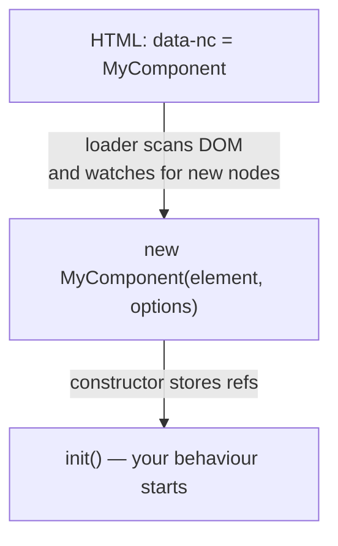

export const meta = {
  order: 3,
  num: '03',
  title: 'JS Components & the Component Loader',
  topics: 'The Netcentric component loader · <code>register</code> · the class pattern · first steps'
};

In Netcentric/AEM projects, JavaScript is initialised through the **Component Loader** — an
open-source library that wires DOM elements to JS classes.

## What it does

- Scans the DOM for elements that declare a component (via a `data-nc` attribute).
- Creates a **class instance** for each match, passing the element + options.
- Keeps watching the DOM and initialises **new** elements added later — essential for a WYSIWYG
  CMS like AEM, where authors add components live.

## Registering a component

Every component is a class, registered with the loader:

```js
import { register } from '@netcentric/component-loader';

class MyComponent {
  constructor(element, options) {
    this.element = element;   // the DOM node with data-nc="MyComponent"
    this.options = options;   // parsed from data-nc-params-…
    this.init();
  }

  init() {
    // do something with this.element …
  }
}

register({ MyComponent });
```

## Wiring it from HTML

The loader matches a registered name to elements carrying the `data-nc` attribute:

```html
<div class="mycomponent__base"
     data-nc="MyComponent"
     data-nc-params-MyComponent='{"key":"value"}'>
  …
</div>
```

On `DOMContentLoaded` the loader checks every registered component against the DOM; on a match,
the class is instantiated.

## The lifecycle, end to end



<Callout type="do">Keep the constructor tiny — store `element`/`options`, then call `init()`. Put real setup (queries, listeners) in `init()` so the flow is easy to read.</Callout>

## 🛠 Practice — your first component

1. Add `data-nc="MyComponent"` to the component's HTML so the loader picks it up.
2. In `my-component.clientlib.js`, register the class.
3. In `init()`, set the text of `.my-component__text` to `"Hello My Component"`:

<Reveal>

```js
init() {
  const text = this.element.querySelector('.my-component__text');
  if (text) text.innerHTML = 'Hello My Component';
}
```

</Reveal>

<Callout type="note">The loader is open source — you can read and contribute to it. Next we'll pass data in (parameters) and find inner elements (DOM references).</Callout>
