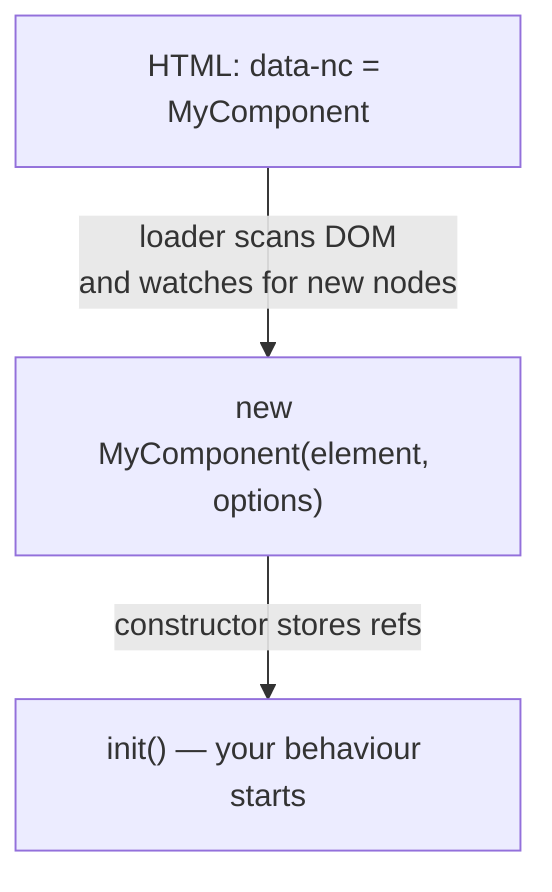

export const meta = {
  order: 3,
  num: '03',
  title: 'JS Components & the Component Loader',
  topics: 'What the loader does · what you need (checklist) · register · the class pattern'
};

In Netcentric/AEM projects, JavaScript is initialised through the **Component Loader** — an
open-source library that wires DOM elements to JS classes. You don't call your component yourself;
you **register** it, mark up an element, and the loader creates an instance for you.

<Callout type="note">**Read along in real code:** the `assignment/js-starter-accordion` branch of the `code` project has a complete, annotated **Accordion**. Get it with `git fetch && git checkout assignment/js-starter-accordion`, then open `ui.frontend/.../publish/components/accordion/accordion.clientlibs.js` — every `[NN]` comment maps to a lesson. This one is `[03]` (`register` + the `data-nc` hook in `accordion.html`).</Callout>

## What it does

- Scans the DOM for elements that declare a component (via a `data-nc` attribute).
- Creates a **class instance** for each match, passing the element + options.
- Keeps watching the DOM and initialises **new** elements added later — essential for a WYSIWYG
  CMS like AEM, where authors add components live.

## What you need to wire up a component

For the loader to pick up and run your component, **five things** must line up. Miss one and
nothing happens (no error) — so it's worth knowing them all.

1. **A class that accepts `(element, options)`.** The loader calls `new YourClass(element, options)`
   for every match. Keep the constructor tiny: store them and call `init()`.
2. **Register the class** with `register({ MyComponent })`. The **name you register**
   (`MyComponent`) is the exact name the loader will look for in the HTML.
3. **Make sure the build includes it** — export it from the publish entry (`index.js`) so the
   bundler ships it. Code that's never imported never runs. (See *Shipping Component JS*.)
4. **Mark up the element** with `data-nc="MyComponent"`. The value must match the registered name
   **exactly** (it's case-sensitive).
5. **The loader runtime must run on the page** — `run()` + `observe()`, loaded via the publish JS
   bundle. Without it, nothing initialises at all.

Optional, but common:

6. **Pass configuration** with `data-nc-params-MyComponent='{ … }'` (valid JSON). It arrives in the
   constructor as `options` — covered in the next lesson.

## Registering a component

```js
import { register } from '@netcentric/component-loader';

class MyComponent {
  constructor(element, options) {
    this.element = element;   // the DOM node with data-nc="MyComponent"
    this.options = options;   // parsed from data-nc-params-…
    this.init();
  }

  init() {
    // do something with this.element …
  }
}

register({ MyComponent });
```

## Wiring it from HTML

The loader matches the registered name to elements carrying the `data-nc` attribute:

```html
<div class="mycomponent__base"
     data-nc="MyComponent"
     data-nc-params-MyComponent='{"key":"value"}'>
  …
</div>
```

On `DOMContentLoaded` the loader checks every registered component against the DOM; on a match,
the class is instantiated.

## The lifecycle, end to end



<Callout type="do">Keep the constructor tiny — store `element`/`options`, then call `init()`. Put real setup (queries, listeners) in `init()` so the flow is easy to read.</Callout>

## Why isn't my component running?

When a component silently does nothing (and there's **no error**), it's almost always one of the
five requirements above:

- the `data-nc` value **doesn't match** the registered name (typo or wrong case);
- the class is **never imported/exported**, so the build left it out;
- the **publish JS bundle isn't loaded** on the page, so the loader never runs;
- the `data-nc-params-…` value is **not valid JSON** (single quotes, trailing comma) and fails to parse.

<Callout type="warn">A mismatch produces **no error** — the loader just finds nothing to do. When in doubt, walk the checklist below: it's nearly always a name mismatch or a missing bundle.</Callout>

## Quick checklist

- [ ] A class that takes `(element, options)` and does setup in `init()`
- [ ] `register({ MyComponent })`
- [ ] Exported from the publish entry so the build bundles it
- [ ] `data-nc="MyComponent"` on the element — name matches **exactly**
- [ ] Publish JS bundle (loader `run()` / `observe()`) loaded on the page
- [ ] *(optional)* config via `data-nc-params-MyComponent='{ … }'` as valid JSON

<Callout type="note">The loader is open source — you can read and contribute to it. Next we'll pass data in (parameters) and find inner elements (DOM references).</Callout>
