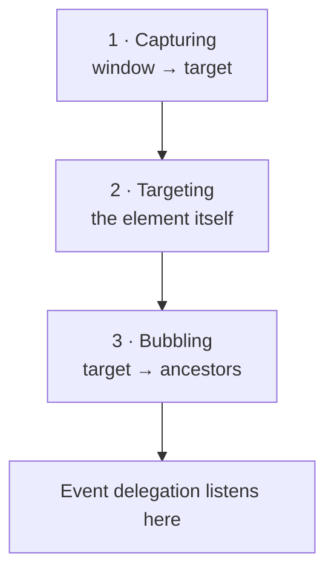

export const meta = {
  order: 5,
  num: '05',
  title: 'Events & Event Delegation',
  topics: 'addEventListener · the event object · delegation · bubbling'
};

Interactivity is built on **events** — code that listens for activity and runs in response.

<Callout type="note">Delegation pays off in real components — later you'll see the example Accordion use **one** delegated `click` listener on its root instead of one per header.</Callout>

## Listening for an event

Pick a target, name the event, give it a callback:

```js
window.addEventListener('resize', () => {
  // do something on resize
});
```

Pass the **event object** to inspect what happened:

```js
button.addEventListener('click', (event) => {
  console.log(event.target);   // the element that was clicked
});
```

## 🛠 Practice — a button listener

Add a click listener to a `.btn` that logs `"button clicked"`:

<Reveal>

```js
const button = document.querySelector('.btn');
button.addEventListener('click', () => console.log('button clicked'));
```

</Reveal>

A working version — click the button and watch the DOM update live:

<Playground
  html={`<button class="btn">Click me</button>
<p class="count">0 clicks</p>`}
  css={`.btn { padding: .5rem 1rem; border: 0; border-radius: 6px; background: #6b2fb3; color: #fff; cursor: pointer; }
.count { font-weight: 700; }`}
  js={`let n = 0;
const btn = document.querySelector('.btn');
const out = document.querySelector('.count');
btn.addEventListener('click', () => {
  n++;
  out.textContent = n + (n === 1 ? ' click' : ' clicks');
});`}
/>

## The three phases

An event travels in three phases: **capturing** (top → target), **targeting** (the element
itself), then **bubbling** (target → up the ancestors). Bubbling is what makes delegation possible.



## Event delegation

Say you have a list and want to react to a click on any item. There's a tempting wrong way and a
better way.

### ❌ Bad — a listener on every child

```js
// one listener per <li>
document.querySelectorAll('.list li').forEach((li) => {
  li.addEventListener('click', () => console.log(li.dataset.info));
});
```

Two real problems:

- **It doesn't scale** — 100 items means 100 listeners to create and keep in memory.
- **It misses future items** — any `<li>` added *after* this code runs has **no** listener. That bites hard in AEM, where author edits and re-rendering inject fresh DOM all the time.

### ✅ Good — one listener on the parent

Attach a **single** listener to the container and work out what was clicked from `event.target`:

```js
list.addEventListener('click', (event) => {
  const item = event.target.closest('li');   // walk up from whatever was clicked
  if (!item) return;                          // click landed outside an <li> → ignore
  console.log(item.dataset.info);
});
```

One listener covers **every** item — including ones added later — because the click **bubbles** up to
the container. `closest('li')` handles clicks on something *inside* the `<li>` (an icon, a `<span>`)
by walking up to the `<li>` you actually care about.

<Callout type="do">Default to **one delegated listener** on the container for lists and repeated items. It's fewer listeners, and — crucially in AEM — it keeps working when items are added or removed.</Callout>

See it: the delegated listener catches clicks on items that **didn't exist** when it was attached. Add a few, then click them — open the console:

<Playground
  html={`<ul class="list">
  <li data-info="One">One</li>
  <li data-info="Two">Two</li>
</ul>
<button class="add">Add item</button>`}
  css={`.list li { cursor: pointer; padding: .25rem .5rem; border-radius: 4px; }
.list li:hover { background: #f0ebf6; }
.add { margin-top: .5rem; padding: .4rem .8rem; border: 0; border-radius: 6px; background: #6b2fb3; color: #fff; cursor: pointer; }`}
  js={`const list = document.querySelector('.list');
const add = document.querySelector('.add');
let n = 2;

// ONE delegated listener — handles current AND future <li>s
list.addEventListener('click', (event) => {
  const li = event.target.closest('li');
  if (li) console.log('clicked: ' + li.dataset.info);
});

// newly added items get NO listener of their own — delegation still catches them
add.addEventListener('click', () => {
  n += 1;
  const li = document.createElement('li');
  li.dataset.info = 'Item ' + n;
  li.textContent = 'Item ' + n;
  list.appendChild(li);
});`}
/>

## 🛠 Practice — delegated list

One `click` listener on the list; if an `<li>` was clicked, alert its `data-info`:

<Reveal>

```js
const list = document.querySelector('.list');
list.addEventListener('click', (event) => {
  const li = event.target.closest('li');
  if (li) alert(li.dataset.info);
});
```

</Reveal>

<Callout type="note">`event.target` is what was actually clicked; `event.currentTarget` is the element the listener is attached to. `closest()` walks up from the target to find the element you care about.</Callout>
