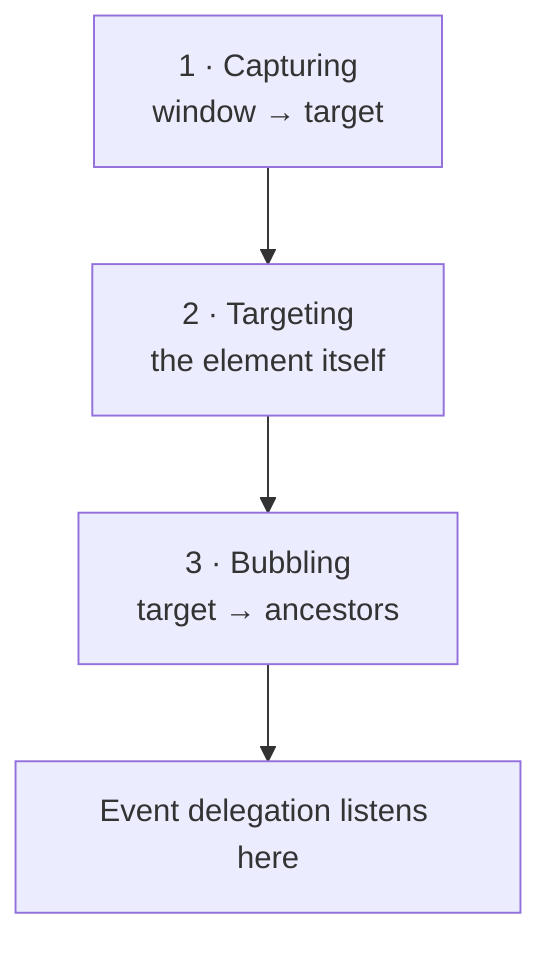

export const meta = {
  order: 5,
  num: '05',
  title: 'Events & Event Delegation',
  topics: 'addEventListener · the event object · delegation · bubbling'
};

Interactivity is built on **events** — code that listens for activity and runs in response.

## Listening for an event

Pick a target, name the event, give it a callback:

```js
window.addEventListener('resize', () => {
  // do something on resize
});
```

Pass the **event object** to inspect what happened:

```js
button.addEventListener('click', (event) => {
  console.log(event.target);   // the element that was clicked
});
```

## 🛠 Practice — a button listener

Add a click listener to `.my-component__button` that logs `"button clicked"`:

<Reveal>

```js
init() {
  const button = this.element.querySelector('.my-component__button');
  button.addEventListener('click', () => console.log('button clicked'));
}
```

</Reveal>

A working version — click the button and watch the DOM update live:

<Playground
  html={`<button class="btn">Click me</button>
<p class="count">0 clicks</p>`}
  css={`.btn { padding: .5rem 1rem; border: 0; border-radius: 6px; background: #6b2fb3; color: #fff; cursor: pointer; }
.count { font-weight: 700; }`}
  js={`let n = 0;
const btn = document.querySelector('.btn');
const out = document.querySelector('.count');
btn.addEventListener('click', () => {
  n++;
  out.textContent = n + (n === 1 ? ' click' : ' clicks');
});`}
/>

## The three phases

An event travels in three phases: **capturing** (top → target), **targeting** (the element
itself), then **bubbling** (target → up the ancestors). Bubbling is what makes delegation possible.



## Event delegation

Instead of a listener on every child, add **one** listener to a parent and decide what to do from
`event.target`. Efficient, and it works for elements added later.

```js
list.addEventListener('click', (event) => {
  const item = event.target.closest('li');
  if (!item) return;                 // ignore clicks outside an <li>
  alert(item.dataset.info);
});
```

<Callout type="do">Use delegation for lists and repeated items: one listener on the container beats N listeners on the children, and it keeps working when items are added/removed.</Callout>

## 🛠 Practice — delegated list

One `click` listener on the list; if an `<li>` was clicked, alert its `data-info`:

<Reveal>

```js
init() {
  this.element.addEventListener('click', (event) => {
    const li = event.target.closest('li');
    if (li) alert(li.dataset.info);
  });
}
```

</Reveal>

<Callout type="note">`event.target` is what was actually clicked; `event.currentTarget` is the element the listener is attached to. `closest()` walks up from the target to find the element you care about.</Callout>
