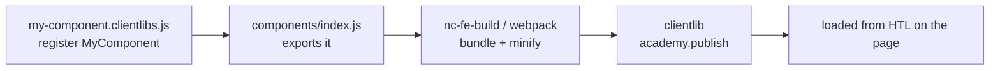

export const meta = {
  order: 7,
  num: '07',
  title: 'Shipping Component JS',
  topics: 'Where JS lives · register &amp; index · the FE build · the loader runtime · loading from HTL'
};

You've written a component class and registered it. This lesson is how that JS actually gets
**built, bundled, and booted** on a page in this project.

<Callout type="note">**In the example** (`assignment/js-starter-accordion`): `accordion.clientlibs.js` `[07]` + `accordion.html` — the clientlib category that loads the component's CSS/JS.</Callout>

## The end-to-end flow



## Where component JS lives

Mirroring the SCSS layout, JS sits next to its component in `ui.frontend`:

```text
ui.frontend/src/main/frontend/academy/publish/components/my-component/
├── my-component.clientlibs.js
└── my-component.clientlibs.scss
```

## Register, then export

The component **registers itself** with the loader, and is **exported** from the publish entry so
the bundler includes it:

```js
// my-component.clientlibs.js
import { register } from '@netcentric/component-loader';

class MyComponent {
  constructor(element, options) {
    this.element = element;
    this.options = options;
    this.init();
  }
  init() { /* … */ }
}

register({ MyComponent });
export default MyComponent;
```

```js
// publish/components/index.js — make the build aware of it
export * from 'academy-base-project/publish/components/my-component/my-component';
```

## The build

`nc-fe-build` (webpack) compiles and minifies the JS into the publish clientlib (e.g.
`publish.bundle.js`) under a category like `academy.publish`.

```bash
npm run build         # full build (styles + webpack)
npm run watch:js      # rebuild JS on change while developing
```

## Loading it from HTL

The page/component pulls the JS clientlib the same way it pulls CSS:

```html
<sly data-sly-use.clientlib="${'/libs/granite/sightly/templates/clientlib.html'}"
     data-sly-call="${clientlib.js @ categories='academy.publish'}"/>
```

(`clientlib.js` = scripts only, `clientlib.css` = styles only, `clientlib.all` = both.)

<Callout type="do">Load the publish JS bundle once (usually from the page template's footer libs), not per component — the loader then wires up every `data-nc` element on the page, including ones authors add live.</Callout>

<Callout type="note">This parallels the Sass track's "Styling an AEM Component" — same `ui.frontend` → build → clientlib → component flow, for behaviour instead of styling.</Callout>
