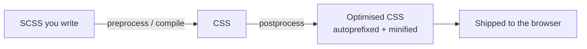

export const meta = {
  order: 1,
  num: '01',
  title: 'What is a Preprocessor',
  topics: 'Why preprocess · the FE build · how SCSS becomes CSS'
};

We don't write CSS to deliver CSS — we write **SCSS** and let a build step compile it. A
**preprocessor** gives us a more comfortable syntax with variables, nesting, functions and
mixins, then outputs plain CSS the browser understands.

## Why bother?

Plain CSS has real limits at scale:

- lots of **repetition**
- **no reusability** of logic
- **no real logic** (conditionals, loops)
- limited **flexibility**

Modern front-end deals with complexity through architecture (BEM, ITCSS, OOCSS), design systems —
and preprocessors are one of the tools that make that practical.

## Where it fits in the build



In this project that's `nc-fe-build`: it compiles `*.scss` into clientlib CSS, then
post-processes (autoprefixing, etc.).

## SCSS vs Sass syntax

There are two syntaxes. **SCSS** is a superset of CSS (curly braces and semicolons — every valid
CSS file is valid SCSS), and it's what we use:

```scss
$brand: #6b2fb3;

.button {
  background: $brand;
  &:hover { filter: brightness(1.1); }
}
```

<Callout type="note">Because SCSS is a superset of CSS, you can paste existing CSS straight in and improve it incrementally — no rewrite needed.</Callout>

## Trying it quickly

The [Sass playground](https://sass-lang.com/playground/) compiles SCSS → CSS live in the
browser — handy for experimenting with the features in the next lessons.

<Callout type="do">Preprocessor power is a means, not an end. The output is still CSS — keep it lean, and don't let nesting or clever functions hide what the final CSS actually does.</Callout>
