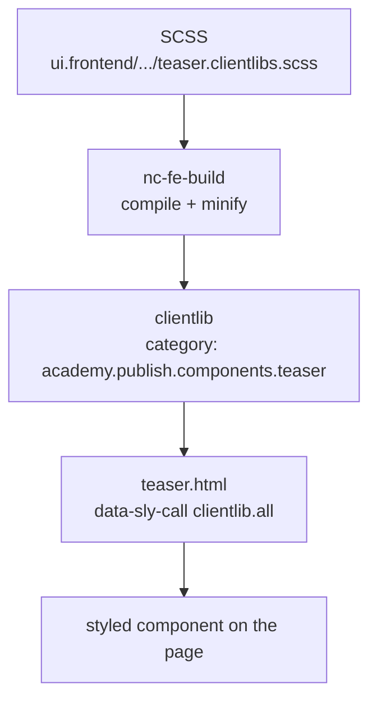

export const meta = {
  order: 5,
  num: '05',
  title: 'Styling an AEM Component',
  topics: 'Where SCSS lives · the clientlib build · categories · loading from HTL'
};

In AEM, a component's CSS is delivered as a **client library** (clientlib). In this project you
author **SCSS** in `ui.frontend`, the build compiles it into a clientlib under a **category**, and
the component loads that category from its HTL.

## The end-to-end flow



## Where the SCSS lives

```text
ui.frontend/src/main/frontend/academy/publish/components/teaser/
└── teaser.clientlibs.scss
```

The build derives the **category from the folder path**:
`academy/publish/components/teaser` → `academy.publish.components.teaser`.

## Write the styles (the project pattern)

The project uses a `$module-name` variable + BEM (enforced by stylelint — next lesson):

```scss
@use "variables/colors" as *;

$module-name: "teaser";

.#{$module-name} {
  &__title { font-size: 2rem; color: var(--brand); }
  &__cta   { text-decoration: underline; }
  &--muted { opacity: .7; }
}
```

## Load it from the component's HTL

Pull the category in with the Granite `clientlib` template:

```html
<sly data-sly-use.clientlib="${'/libs/granite/sightly/templates/clientlib.html'}"
     data-sly-call="${clientlib.all @ categories='academy.publish.components.teaser'}"/>

<section class="teaser">
  <h2 class="teaser__title">${teaser.title}</h2>
</section>
```

- `clientlib.all` injects CSS **and** JS; `clientlib.css` / `clientlib.js` load just one.
- The `categories` string must match the generated category **exactly**.

<Callout type="do">One SCSS folder per component, named to match the component, producing one predictable category. That keeps the clientlib graph obvious as the project grows.</Callout>

<Callout type="note">This mirrors the Component Creation track's "Adding the Clientlibs" lesson — here we focus on the **SCSS authoring** side; there on the component wiring.</Callout>
