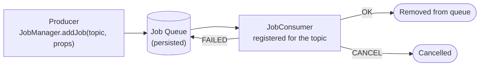

export const meta = {
  order: 1,
  num: '01',
  title: 'What are Sling Jobs?',
  topics: 'guaranteed async processing · vs scheduler · topics · queues'
};

A **Sling Job** is a unit of work you hand to the platform to run **asynchronously**, in the background,
with a **guarantee** it will be processed — even across restarts.

## The model: producer → queue → consumer

A producer adds a job to a **topic**; the platform persists it in a **queue** and hands it to a
registered **consumer**. If processing fails, the job is **retried**; nothing is silently lost.

## Why not just a thread or a scheduler?

| | New `Thread` | Scheduler | **Sling Job** |
|---|---|---|---|
| Survives restart | ✗ | ✗ (just re-fires on schedule) | ✓ persisted + retried |
| Guaranteed once | ✗ | ✗ | ✓ (at-least-once) |
| Distributed (cluster) | ✗ | runs per instance | ✓ processed once in the cluster |
| Best for | nothing in AEM | *time-based* recurring tasks | *event-driven* background work |

- **Scheduler** answers *"every night at 2am"* — recurring, time-based.
- **Sling Jobs** answer *"do this reliably, soon, off the request thread"* — e.g. send an email after form submit, re-index something, call a slow API.

<Callout type="do">Use a Sling Job to move slow or unreliable work **off the request/workflow thread** while guaranteeing it runs. Use the **Scheduler** for purely time-triggered recurring tasks.</Callout>

<Callout type="note">Workflows can **offload** heavy steps to a Sling Job (you saw this in *Workflows → Best Practices*) so the workflow thread isn't held by long I/O.</Callout>
