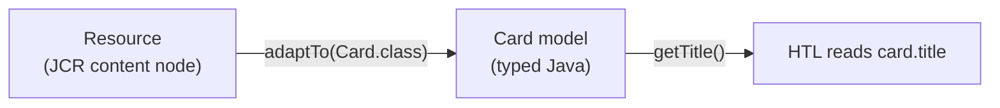

export const meta = {
  order: 1,
  num: '01',
  title: 'Sling Models & Adaptation',
  topics: 'what a Sling Model is · adaptTo · @Model · the view/logic split'
};

A **Sling Model** is a plain Java class that maps repository content (a resource) onto typed Java
fields, so your HTL stays logic-free and your business logic stays testable.

## The idea: adapt a resource to a model

Sling's **adapter** pattern turns one object into another. A Sling Model is the target of an
`adaptTo` call:

```java
Resource resource = ...;
Card card = resource.adaptTo(Card.class);   // content → typed object
```



HTL does the same declaratively with `data-sly-use`, so the component's markup just reads properties:

```html
<sly data-sly-use.card="com.example.core.models.Card"/>
<h3>${card.title}</h3>
```

## Declaring a model

A class becomes a model with **`@Model`**, naming what it can be adapted *from*:

```java
@Model(
  adaptables = Resource.class,
  defaultInjectionStrategy = DefaultInjectionStrategy.OPTIONAL
)
public class Card {
  @ValueMapValue
  private String title;

  public String getTitle() { return title; }
}
```

- **`adaptables`** — `Resource.class`, `SlingHttpServletRequest.class`, or both.
- **`defaultInjectionStrategy = OPTIONAL`** — missing properties become `null` instead of failing the adaptation. Strongly recommended.

## Why models beat scriptlets

<Callout type="do">Keep logic in the model, presentation in HTL. The model is a normal Java class — you can **unit-test** it without an AEM server, and the HTL stays declarative and designer-friendly.</Callout>

<Callout type="note">A model returns `null` from `adaptTo` if a **required** injection can't be satisfied — that's why `OPTIONAL` + null-checks (or `@Default`) keep components resilient. We'll see required vs optional next.</Callout>
