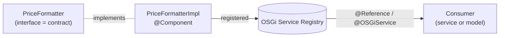

export const meta = {
  order: 5,
  num: '05',
  title: 'OSGi Services',
  topics: '@Component · interface + impl · @Reference · cardinality · immediate'
};

When logic doesn't belong to one component — formatting prices, calling an API, shared business rules —
it becomes an **OSGi service**: a singleton the container manages and injects where needed.

## Interface + implementation

Define the **contract** as an interface and the **implementation** as an `@Component` that provides it:

```java
public interface PriceFormatter {
  String format(long cents, Locale locale);
}

@Component(service = PriceFormatter.class)
public class PriceFormatterImpl implements PriceFormatter {
  public String format(long cents, Locale locale) {
    return NumberFormat.getCurrencyInstance(locale).format(cents / 100.0);
  }
}
```

Consumers depend on the **interface**, never the impl — so you can swap or mock it.



## Consuming a service with `@Reference`

```java
@Component(service = ReportService.class)
public class ReportServiceImpl implements ReportService {
  @Reference
  private PriceFormatter formatter;        // injected by the container
}
```

In a Sling Model you use `@OSGiService` instead — same idea, model-side.

## Cardinality & optionality

A `@Reference` says how many providers it needs and whether it's mandatory:

- **Mandatory** (default) — the component won't activate until the reference is satisfied.
- **Optional** — `cardinality = OPTIONAL`; the component runs without it (field may be null).
- **Multiple** — `cardinality = MULTIPLE`; inject a `List<T>` of all providers (e.g. a set of pluggable handlers).

```java
@Reference(cardinality = ReferenceCardinality.MULTIPLE,
           policy = ReferencePolicy.DYNAMIC)
private volatile List<AssetHandler> handlers;
```

## Immediate components

```java
@Component(immediate = true)
```

By default a service component is **lazy** — instantiated when first used. `immediate = true` activates
it at bundle start (use it for listeners/schedulers that must run without being referenced).

<Callout type="do">Program to the **interface**. Keep services single-purpose. Use **mandatory** references for true dependencies and **optional/multiple** for pluggable extensions — and check the component's state in `/system/console/components` if it won't activate (usually an unsatisfied reference).</Callout>
