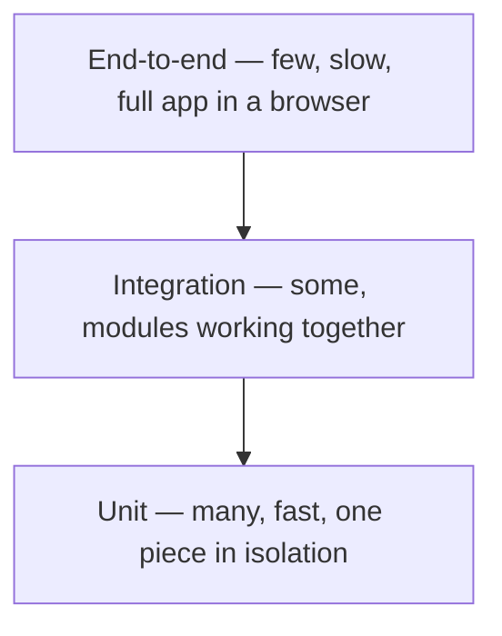

export const meta = {
  order: 1,
  num: '01',
  title: 'Testing Fundamentals',
  topics: 'Why unit-test · unit vs integration vs e2e · the AAA pattern · what makes a good test'
};

A **unit test** checks one small piece of code (a function, a module) in **isolation**, automatically.
On the front end it lets you change code with confidence — refactor, add features, fix bugs — and
get an instant signal if you broke something.

## Why bother?

- **Confidence** to refactor and ship — the tests catch regressions.
- **Faster feedback** than clicking through the UI by hand.
- **Living documentation** — a test shows how a function is meant to be used.
- **Better design** — code that's hard to test is usually too tightly coupled.

## The testing pyramid



| Level | Scope | Speed | How many |
|---|---|---|---|
| **Unit** | one function/module, isolated | very fast | many |
| **Integration** | several units together | medium | some |
| **End-to-end (E2E)** | the whole app in a browser | slow | few |

This track is about the **base of the pyramid**: fast, focused unit tests (with a little DOM
testing) using **Jest**.

## The AAA pattern

Almost every good test has three parts:

```js
test('adds two numbers', () => {
  // Arrange — set up inputs and state
  const a = 2, b = 3;

  // Act — run the thing under test
  const result = sum(a, b);

  // Assert — check the outcome
  expect(result).toBe(5);
});
```

## What makes a good unit test

<Callout type="do">A good test is **fast**, **isolated** (no real network/disk/other tests), **deterministic** (same result every run), and tests **behaviour/output** — not private implementation details.</Callout>
<Callout type="dont">Don't test the framework, don't assert on internal variables that aren't part of the contract, and avoid tests that only pass "by accident" of the current implementation — they break on every refactor.</Callout>

<Callout type="note">Rule of thumb: test the **inputs and outputs** (and side effects) a caller actually relies on. If a refactor that keeps behaviour identical breaks your test, the test was too tightly coupled.</Callout>
