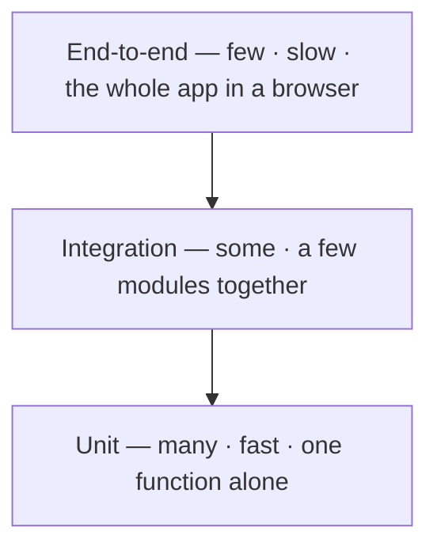

export const meta = {
  order: 1,
  num: '01',
  title: 'Testing Fundamentals',
  topics: 'why test · unit vs integration vs e2e · the AAA pattern · what makes a good test'
};

A **unit test** is a tiny program that checks **one function gives the right answer**. You write it
once; it runs in a fraction of a second and tells you instantly if a change broke something.

Say you have this function:

```js
export function sum(a, b) {
  return a + b;
}
```

A unit test for it is just: *"if I call it with these inputs, do I get the expected output?"*

```js
test('adds two numbers', () => {
  expect(sum(2, 3)).toBe(5);
});
```

That's the whole idea. Everything else is detail.

## Why test something this simple?

`sum` looks too trivial to test — until someone changes it. Say a later edit slips in a typo:

```js
export function sum(a, b) {
  return a - b;   // oops — meant +
}
```

Without a test, that ships and quietly breaks every total that depends on it — and you hear about
it from a user. With the test, the moment you save you get:

```text
✕ adds two numbers
  Expected: 5
  Received: -1
```

Red immediately, naming the exact function — before the bug ever leaves your machine. The point
isn't proving `2 + 3 = 5` today; it's **catching the day someone makes it stop**.

## Why write them?

- **Confidence to change.** Refactor or add a feature, run the tests — green means you didn't break the old behaviour.
- **Faster than clicking.** A test runs in milliseconds; checking by hand in the browser takes minutes, every time.
- **Documentation that can't lie.** The test name + inputs show how the function is meant to be used. If it goes stale, it fails.
- **Better design.** If a function is hard to test, it's usually doing too much — testing nudges you to keep it small.

## Unit vs integration vs e2e



Write **lots of unit tests** (fast, precise), **fewer** integration tests, and **very few** end-to-end
tests (slow, and when they fail they don't tell you *where*). This track is the **bottom** of the
pyramid.

## The AAA pattern

Almost every test has the same three steps — **Arrange, Act, Assert**. Write them as three blocks
separated by a blank line, so any test reads top-to-bottom at a glance:

```js
test('adds two numbers', () => {
  // Arrange — set up the inputs
  const a = 2;
  const b = 3;

  // Act — run the function once
  const result = sum(a, b);

  // Assert — check the result
  expect(result).toBe(5);
});
```

| Step | What it does |
|---|---|
| **Arrange** | set up the inputs and any state the function needs |
| **Act** | call the function under test — usually **one** line |
| **Assert** | check the returned value against what you expected |

Short tests can collapse all three into one line (`expect(sum(2, 3)).toBe(5)`) — the steps are still
there, just inline. Keep them as separate blocks as soon as the arrange step grows.

Name the test after the **behaviour** (`'adds two numbers'`), never `'test1'` — so when it fails,
the name alone tells you what broke.

## Where the test earns its keep

`sum` needs little more than one test. Most real functions have **edge cases** — and that's where a
unit test pays off. Take a discount:

```js
export function applyDiscount(total, percent) {
  return total - (total * percent) / 100;
}
```

The normal case looks fine and passes:

```js
test('takes 10% off the total', () => {
  expect(applyDiscount(200, 10)).toBe(180);   // ✓ passes
});
```

So you ship it. But add **one edge case** and the test goes red:

```js
test('never returns a negative price', () => {
  expect(applyDiscount(200, 150)).toBeGreaterThanOrEqual(0);
});
```

```text
✕ never returns a negative price
  Expected: >= 0
  Received: -100
```

A 150% discount makes the price **negative** — a real bug the happy path never revealed. The test
caught it on your machine, not from an angry customer. So you add a guard:

```js
export function applyDiscount(total, percent) {
  const safe = Math.min(Math.max(percent, 0), 100);   // clamp to 0–100
  return total - (total * safe) / 100;
}
```

…and the test goes green. **That's the point of unit testing: the cases you didn't think of are the
ones that bite.** The next lessons cover picking the right **matcher** and covering those edges on
purpose.

<Callout type="do">A good unit test is **fast**, **independent** (doesn't rely on other tests), and checks the **result**, not how the function does it inside. If you rename a private variable and a test breaks, that test was checking the wrong thing.</Callout>
