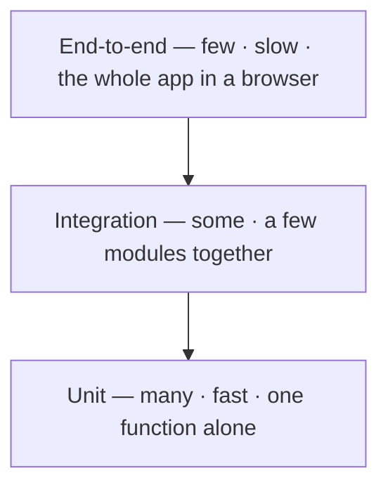

export const meta = {
  order: 1,
  num: '01',
  title: 'Testing Fundamentals',
  topics: 'why test · unit vs integration vs e2e · the AAA pattern · what makes a good test'
};

A **unit test** is a tiny program that checks **one function gives the right answer**. You write it
once; it runs in a fraction of a second and tells you instantly if a change broke something.

Say you have this function:

```js
export function applyDiscount(total, percent) {
  return total - (total * percent) / 100;
}
```

A unit test for it is just: *"if I call it with these inputs, do I get the expected output?"*

```js
test('takes 10% off the total', () => {
  expect(applyDiscount(200, 10)).toBe(180);
});
```

That's the whole idea. Everything else is detail.

## Why write them?

- **Confidence to change.** Refactor or add a feature, run the tests — green means you didn't break the old behaviour.
- **Faster than clicking.** A test runs in milliseconds; checking by hand in the browser takes minutes, every time.
- **Documentation that can't lie.** The test name + inputs show how the function is meant to be used. If it goes stale, it fails.
- **Better design.** If a function is hard to test, it's usually doing too much — testing nudges you to keep it small.

## Unit vs integration vs e2e



Write **lots of unit tests** (fast, precise), **fewer** integration tests, and **very few** end-to-end
tests (slow, and when they fail they don't tell you *where*). This track is the **bottom** of the
pyramid.

## The AAA pattern

Almost every test reads in three steps — **Arrange, Act, Assert**:

```js
test('takes 10% off the total', () => {
  const total = 200;                          // Arrange — set up the inputs
  const result = applyDiscount(total, 10);    // Act    — run the function
  expect(result).toBe(180);                   // Assert — check the answer
});
```

Name the test after the **behaviour** (`'takes 10% off the total'`), never `'test1'` — so when it
fails, the name alone tells you what broke.

<Callout type="do">A good unit test is **fast**, **independent** (doesn't rely on other tests), and checks the **result**, not how the function does it inside. If you rename a private variable and a test breaks, that test was checking the wrong thing.</Callout>
