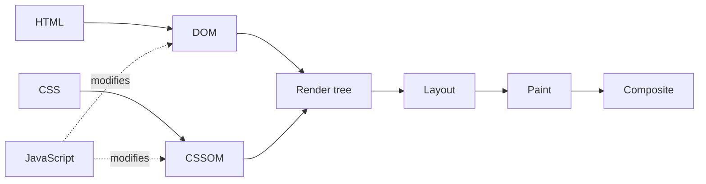

export const meta = {
  order: 1,
  num: '01',
  title: 'The Critical Rendering Path',
  topics: 'How a page renders · what is on the critical path · render-blocking resources'
};

The **critical rendering path** is how quickly the browser can turn your HTML, CSS, and JavaScript
into the first pixels on screen. Understanding it is the foundation of every other optimisation in
this track.

## How a page renders



The steps the browser performs:

1. Construct the **DOM** from the HTML.
2. Construct the **CSSOM** from the CSS.
3. Apply any **JavaScript** that alters the DOM or CSSOM.
4. Build the **render tree** from the DOM and CSSOM.
5. Run **layout** (where each element fits).
6. **Paint** the pixels.
7. **Composite** overlapping layers and draw to screen.

The fewer resources the browser must wait for — and the smaller they are — the sooner the initial
render happens.

## What's on the critical path?

Before the browser can complete the **initial render**, it must download some critical resources:

- Part of the HTML.
- **Render-blocking CSS** in the `<head>`.
- **Render-blocking JavaScript** in the `<head>`.

For that first render, the browser typically does **not** wait for:

- All of the HTML.
- Fonts.
- Images.
- Non-render-blocking JavaScript (e.g. `<script>` at the end of the body, or `defer`/`async`).
- Non-render-blocking CSS (e.g. a `<link>` with a `media` value that doesn't match the viewport).

<Callout type="note">Goal: keep the critical path short. Minimise the *number*, *size*, and *blocking-ness* of the resources needed for that first paint.</Callout>

## Render-blocking resources

Some resources are so critical that the browser **pauses rendering** until it has processed them.
**CSS is render-blocking by default**: when the browser encounters CSS — inline in a `<style>`, or
an external `<link rel="stylesheet">` — it won't render more content until that CSS is downloaded
and processed.

You can make a stylesheet **non-render-blocking** by giving its `<link>` a `media` attribute whose
value doesn't match the current conditions:

```html
<!-- Only render-blocking when printing; not for the initial screen render -->
<link rel="stylesheet" href="print.css" media="print">

<!-- Only blocks on wide viewports -->
<link rel="stylesheet" href="wide.css" media="(min-width: 60em)">
```

<Callout type="do">Ship only the CSS the page actually needs to render, keep render-blocking JavaScript out of the `<head>`, and split off non-critical styles with `media`. Everything in this track builds on shortening this path.</Callout>

<Callout type="note">This track is adapted from Google's [web.dev — Learn Performance](https://web.dev/learn/performance) and the Netcentric Web Performance course.</Callout>
