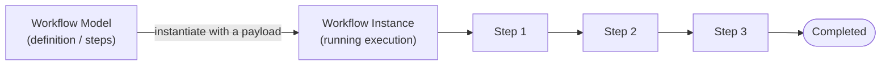
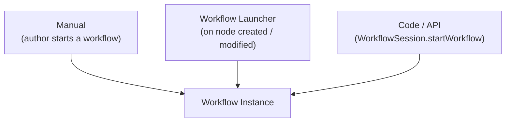

export const meta = {
  order: 1,
  num: '01',
  title: 'Workflow Model vs Instance, & Triggering',
  topics: 'definition vs running instance · payload · launchers · triggering in code'
};

An AEM **workflow** automates a sequence of steps over a piece of content. Two words to keep straight:
the **model** (the design) and the **instance** (one running execution).

## Model vs instance

- **Workflow model** — the *definition*: an ordered set of steps, stored under `/var/workflow/models` (and authored in `/conf`). Like a class.
- **Workflow instance** — one *execution* of a model against a **payload** (usually a page or asset path). Like an object. It has state, a current step, and a history.



## What triggers an instance



- **Manually** — an author selects content → *Create Workflow*.
- **Launcher** — a rule that auto-starts a model when a node under a path is created/modified (e.g. start *DAM Update Asset* when an asset is uploaded). Configured at `/libs/.../workflow/launcher`.
- **In code** — start it programmatically:

```java
WorkflowSession wfSession = resolver.adaptTo(WorkflowSession.class);
WorkflowModel model = wfSession.getModel("/var/workflow/models/academy/review");
WorkflowData data = wfSession.newWorkflowData("JCR_PATH", "/content/academy/en");
wfSession.startWorkflow(model, data);
```

<Callout type="do">Use a **launcher** for "whenever X happens, run this" automation; start in **code** when a service decides to kick off processing. Reserve **manual** start for human-initiated flows like review/publish requests.</Callout>

<Callout type="note">Asset processing (renditions, metadata) is itself a workflow — *DAM Update Asset* — started by a launcher when you upload to the DAM. You met its output (renditions) in *Advanced AEM*.</Callout>
