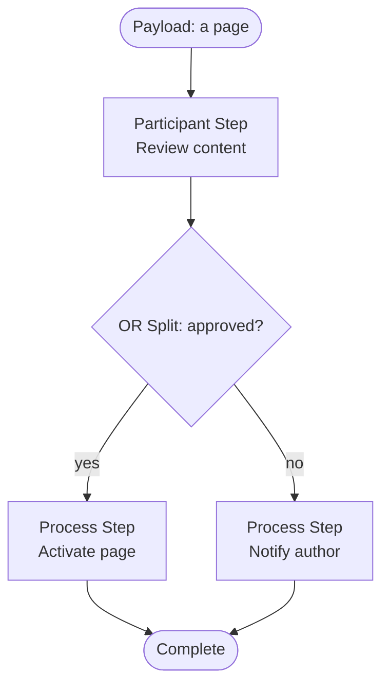

export const meta = {
  order: 2,
  num: '02',
  title: 'Designing a Workflow',
  topics: 'the workflow editor · step types · stages · splits'
};

You design a model visually in the **Workflow editor** (Tools → Workflow → Models), dragging steps onto
the flow and configuring each.

## Step types

| Step | Does |
|---|---|
| **Participant** | assigns a *human* task — lands in someone's Inbox until actioned |
| **Process** | runs an *automatic* server-side process (Java / ECMA) |
| **Dynamic Participant** | picks the assignee at runtime via a chooser |
| **OR Split** | branches down one path based on a condition |
| **AND Split** | runs multiple branches in parallel, re-joined later |
| **Container** | runs another workflow model as a sub-flow |
| **Goto** | jumps to another step (loops, retries) |

## A worked example

A simple review-and-publish model:

## Stages

A model can declare **stages** (e.g. *Draft → In Review → Approved*) shown as a progress bar on the
instance — handy for long, human-driven flows so everyone sees where the payload is.

<Callout type="do">Keep models small and composable: a **Container** step lets you reuse a sub-workflow instead of copying steps. Use an **OR split** for branching decisions and an **AND split** only when branches are genuinely independent.</Callout>

<Callout type="warn">Participant steps block until a human acts — great for approvals, but don't put one in an automated, high-volume flow or instances pile up in inboxes. For pure automation, chain **process** steps.</Callout>
