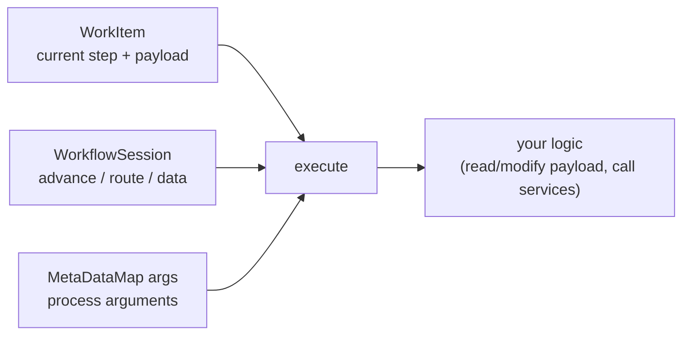

export const meta = {
  order: 3,
  num: '03',
  title: 'Custom Workflow Process (Java)',
  topics: 'WorkflowProcess · execute() · WorkItem & payload · process arguments'
};

When no built-in step does what you need, write a **custom process step** — a Java `WorkflowProcess`
that your model's Process step calls by label.

## Implement `WorkflowProcess`

```java
@Component(
  service = WorkflowProcess.class,
  property = { "process.label=Academy: Stamp Reviewed Date" })
public class StampReviewedProcess implements WorkflowProcess {

  @Override
  public void execute(WorkItem item, WorkflowSession session, MetaDataMap args)
      throws WorkflowException {

    // 1. get the payload path
    String path = item.getWorkflowData().getPayload().toString();

    // 2. do the work via a resolver
    try (ResourceResolver resolver = /* service resolver */ getResolver()) {
      Resource res = resolver.getResource(path + "/jcr:content");
      ModifiableValueMap vm = res.adaptTo(ModifiableValueMap.class);
      vm.put("reviewedAt", Calendar.getInstance());
      resolver.commit();
    } catch (Exception e) {
      throw new WorkflowException("Failed to stamp " + path, e);
    }
  }
}
```

The `process.label` is what you select in the **Process** step's dropdown in the editor.

## What you get in `execute`



- **`WorkItem`** — the current step and the **payload** (`getWorkflowData().getPayload()`).
- **`WorkflowSession`** — advance/route the instance, read/write workflow metadata.
- **`MetaDataMap args`** — the **Process Arguments** configured on the step (`args.get("PROCESS_ARGS", String.class)`), so one process serves many configs.

<Callout type="warn">Don't open an admin session — use a **service user** resolver (`getServiceResourceResolver` with a mapped subservice). And keep process steps **idempotent**: a workflow can be retried, so running twice must be safe (you saw idempotency in the JS module too).</Callout>

<Callout type="do">Read inputs from `MetaDataMap` so the step is reusable, throw `WorkflowException` on failure (so the instance is marked failed, not silently passed), and keep the work short — long steps hold workflow threads.</Callout>
