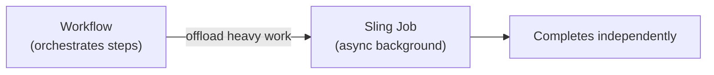

export const meta = {
  order: 4,
  num: '04',
  title: 'Workflow Best Practices',
  topics: 'transient workflows · idempotency · service users · cleanup'
};

Workflows are powerful but easy to misuse at scale. A few rules keep instances healthy.

## Practices

- **Use transient workflows** when you don't need history. A *transient* model leaves **no instance nodes** in the repository — essential for high-volume flows (e.g. asset processing) so the repo doesn't bloat.
- **Keep process steps idempotent.** Failures cause retries; running a step twice must be safe.
- **Use a service user**, never admin, in custom processes — least privilege, and it survives security hardening.
- **Throw `WorkflowException` on failure** so the instance fails visibly instead of silently completing.
- **Read config from Process Arguments** (`MetaDataMap`) so one process class serves many steps.
- **Clean up.** Schedule **workflow purging** (Adobe Granite Workflow Purge) for completed/running instances, or use transient models, so `/var/workflow/instances` stays small.

## Don't

- Put **participant** (human) steps in automated high-volume flows.
- Do long-running I/O inline in a step — offload to a **Sling Job** (next module) and let the workflow continue.
- Forget to handle the **payload may be gone** (deleted/moved) by the time the step runs.

<Callout type="do">Transient + idempotent + service-user + purged is the recipe for workflows that scale. If a step is slow or bursty, hand it to a **Sling Job** and keep the workflow responsive.</Callout>
